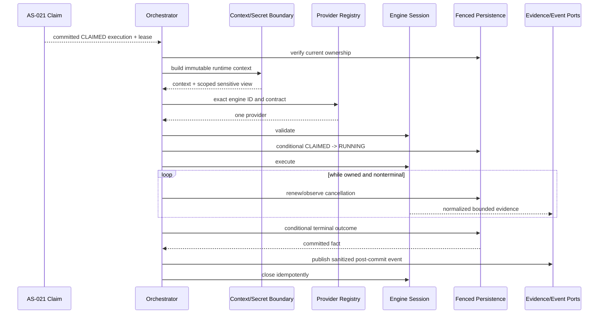

# ADR-012: Engine-Neutral Runner Execution Orchestrator

## Status

Proposed

AS-022A is documentation only. This ADR requires approval before AS-022B production design or
implementation begins.

## Context

AS-018 admits executions and persists immutable request-time snapshots and the authoritative
execution lifecycle. AS-019 makes PostgreSQL and `execution_lease` the queue/ownership mechanism,
with claim-token, generation, lease-version, heartbeat, expiry, and reclaim fencing. AS-020
registers runner identity and capabilities. AS-021 selects compatible work and atomically commits
`PENDING -> CLAIMED` plus the lease.

After a claim, the platform still needs to prepare runtime inputs, resolve secrets, select and
invoke an automation engine, supervise timeout and cancellation, collect normalized results and
evidence, and persist a terminal outcome. The roadmap includes Playwright, Selenium, Karate,
REST Assured, mobile, and future custom or AI-native engines. Putting provider logic in the
orchestrator would make the lifecycle, security, and persistence model depend on the first
engine.

Execution performs network, filesystem, process, and engine work that may last much longer than a
database transaction. A stale runner must never finalize after its lease has expired or been
replaced. Resolved secrets and claim tokens must not leak into engines, durable snapshots,
evidence metadata, events, or logs.

ADR-001 already selects modular engine architecture. ADR-012 refines the runner-side
orchestration and ownership boundary without implementing it.

## Decision

### Use one engine-neutral orchestration pipeline

The runner will execute every provider through the same ordered pipeline:

```text
verify claim ownership
    -> load immutable context
    -> resolve environment and scoped secrets
    -> select exact engine provider
    -> validate
    -> fenced start
    -> execute under lease/deadline/cancellation supervision
    -> normalize results and evidence
    -> fenced terminal write
    -> publish committed facts
    -> clean up
```

The orchestrator owns ordering, supervision, failure precedence, and platform state. It contains
no Playwright-, Selenium-, Karate-, REST Assured-, mobile-, or provider-specific branch.

### Separate persisted lifecycle from runner-local phases

The existing AS-018 statuses remain authoritative:

```text
PENDING -> CLAIMED -> RUNNING -> PASSED | FAILED | ERROR
                         \----> CANCEL_REQUESTED -> CANCELLED | ERROR
```

`STARTING`, `EXECUTING`, `FINALIZING`, and cleanup are local orchestration phases, not new
persisted statuses. Completed assertions map to `PASSED` or `FAILED`; timeout, startup failure,
crash, infrastructure failure, and unexpected failure map to `ERROR`; cooperative cancellation
maps to `CANCELLED`.

This avoids a competing lifecycle and preserves existing API/database compatibility.

### Build one immutable execution context from admitted snapshots

Before engine selection, a context loader will validate and deep-copy the immutable execution,
environment, suite, request, and ordered case snapshots. It will add normalized Project identity,
deterministically merged non-secret variables, canonical engine identity, runner metadata,
ownership controls, deadline, cancellation signal, and evidence policy.

Mutable catalog records do not redefine admitted work. Missing, malformed, or inconsistent
mandatory snapshot data fails closed. Resolved secrets are held in a distinct invocation-scoped
sensitive view and are never written back to the context's durable snapshot representation.

### Depend on a versioned provider contract

An engine provider declares a stable engine ID, implementation version, supported contract
versions, and capabilities. It validates a context and creates one execution session. The session
executes, accepts cooperative cancellation, emits normalized events, and closes idempotently.

Provider resolution requires exactly one enabled exact engine-ID match with a compatible
contract. Classpath/discovery order is not a selection rule. Engines cannot access platform
repositories, leases, arbitrary secrets, scheduling, authorization, durable event publication,
or authoritative outcome transitions.

### Keep ownership and state changes runner-mediated and fenced

`execution_lease` remains the only current ownership record. The ownership coordinator alone
holds the claim token and validates execution ID, runner key, token, generation, lease version,
expiry, and expected execution status/version.

Start and completion use short conditional transactions. External preparation and engine work
run outside database and AS-021 scheduling transactions. A stale or replaced runner stops work
and cannot write an outcome.

AS-022 implementation must explicitly extend/reconcile AS-019 renewal semantics for `RUNNING`
and cooperative `CANCEL_REQUESTED` work; the existing `CLAIMED`-only heartbeat must not be
silently treated as sufficient. PostgreSQL time, generation fencing, lease-local optimistic
version, and the established lock order remain authoritative.

### Treat evidence and events as ports

Engines emit normalized logs, screenshots, console output, attachments, native reports, and
bounded metadata into an orchestrator-owned evidence sink. An evidence storage port owns bytes;
platform persistence owns reviewed metadata. Storage technology is deferred.

Events describe committed, sanitized facts and are emitted post-commit. Consumers must tolerate
duplicates. Reliable delivery/outbox implementation requires a later approved decision.

### Classify errors without implementing execution retries

The orchestrator distinguishes completed assertion failure (`FAILED`) from operational failure
(`ERROR`), cancellation (`CANCELLED`), and lost ownership (no stale write). Failure precedence is
lost ownership, accepted cancellation, timeout, operational failure, then engine result.

Transient startup or infrastructure failures may be marked retryable for future policy.
Invalid configuration/snapshots, unsupported providers, authorization failures, assertion
failures, cancellation, and default timeouts are non-retryable. Retrying an idempotent upload or
fenced write never reruns the engine. Execution retries and attempts are deferred.

## Architectural Sequence



## Alternatives Considered

### Embed Playwright logic in the orchestrator

Rejected. It couples platform lifecycle, configuration, evidence, and failure handling to the
first provider and makes every future engine an orchestrator change.

### Let each engine own the complete workflow

Rejected. Engines would duplicate leasing, secret access, timeout, cancellation, persistence,
security, and event behavior, producing inconsistent and unsafe outcomes.

### Let engines write execution tables directly

Rejected. It bypasses fencing and aggregate invariants, grants provider code excessive authority,
and makes normalized outcomes impossible to enforce.

### Execute inside the claim or HTTP transaction

Rejected. Long external work would hold database resources and scheduling locks, couple runtime
failure to request handling, and prevent robust lease supervision.

### Create a second orchestration state table now

Rejected. Runner-local phases are operational signals and do not yet require durable recovery.
A new table would imply resume/attempt semantics that AS-022A deliberately defers.

### Persist STARTING, COMPLETED, and TIMED_OUT as new execution statuses

Rejected. Existing statuses already distinguish business result, operational error, and
cancellation. Adding aliases would break established lifecycle/API compatibility and create
ambiguous terminal meanings. Structured phase and error categories retain the extra detail.

### Re-read mutable suite and environment records at runtime

Rejected. Catalog changes after admission would make execution nondeterministic and violate the
immutable-snapshot contract. Runtime secret values are resolved from admitted references without
changing admitted meaning.

### Pass lease credentials into the engine

Rejected. Engines need no ownership authority. The orchestrator retains credentials so a
compromised or defective provider cannot renew, finalize, or impersonate the runner.

### Select providers by dependency-injection or classpath order

Rejected. Order may vary by build and deployment. Exact ID plus contract compatibility is
deterministic and fails safely on ambiguity.

### Use exceptions as the engine result contract

Rejected. Exceptions alone cannot distinguish completed assertion failures, cancellation,
timeout, crash, evidence problems, and normalized partial results. The contract needs explicit
typed results and error categories.

### Add automatic execution retries now

Rejected. Safe rerun requires attempt identity, history, idempotency, policy, ownership, and
user-visible semantics. Retrying without those decisions risks duplicate side effects.

## Consequences

### Benefits

- New engines plug into one provider contract without changing orchestration.
- Immutable snapshots and exact provider selection keep runs reproducible.
- Lease fencing prevents stale runners from authoritatively starting or completing work.
- Secrets and ownership credentials remain behind narrow runner-owned boundaries.
- Lifecycle, errors, evidence, and events are normalized across providers.
- Short transactions preserve AS-021 concurrency and database integrity.
- Deferred storage, delivery, and isolation technologies can evolve behind ports.

### Trade-offs

- A common contract limits direct exposure of provider-specific features.
- Contract versioning and compatibility tests require ongoing governance.
- Cooperative cancellation quality depends on provider behavior and isolation.
- The runner must supervise lease renewal concurrently with engine execution.
- Snapshot validation and context construction add startup work.
- Without durable attempt/resume semantics, a runner crash during `RUNNING` needs a later recovery
  policy rather than implicit reassignment.
- Post-commit event publication is at-least-once/best-effort until durable delivery is approved.

## Security

Resolved secrets are invocation-scoped and supplied only when explicitly referenced and
authorized. Claim tokens never cross the ownership boundary. Provider output, filenames,
metadata, paths, and logs are untrusted and bounded. Ordinary logs, errors, events, and artifact
metadata exclude credentials, tokens, secret values/references, complete snapshots, and raw
variable maps.

Dynamic third-party plugin trust, signing, marketplace distribution, and strong process/container
isolation are deferred. A built-in first provider must still obey the same least-authority
contract.

## Compatibility

This decision preserves AS-018 statuses and immutable snapshots, AS-019 lease ownership and
fencing, AS-020 runner identity/capabilities, and AS-021 atomic scheduling. AS-022A changes no
schema, API, production code, or tests.

Later lifecycle work must reconcile heartbeat renewal for `RUNNING`/`CANCEL_REQUESTED` explicitly
and prove that cancellation, terminal writes, heartbeat, and ownership operations obey one
reviewed lock order. It must not weaken existing claim generation or database-time expiry.

## Deferred Decisions

- Java/wire shape and version policy for the engine contract;
- first concrete engine adapter;
- execution attempts, retries, resume, and orphaned `RUNNING` recovery;
- parallel/distributed execution and remote clusters;
- artifact storage, retention, video, and live streaming;
- event outbox and delivery guarantees;
- plugin discovery, installation, signing, marketplace, and isolation;
- source-workspace and secret-provider implementations;
- durable fine-grained orchestration telemetry;
- execution history UI; and
- runner/secret authentication and authorization enforcement.

## Review Gate

Approve ADR-012 and the AS-022A requirements/development plan before implementing AS-022B.

