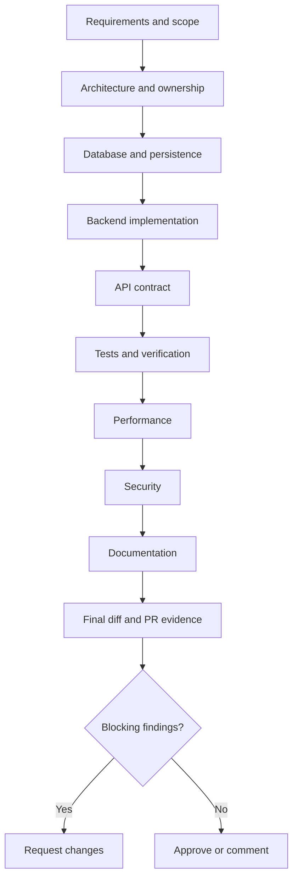

# Automation Studio Engineering Review Checklist

This document defines the official engineering review process for Automation Studio. It supports human reviewers and AI-assisted reviews across architecture, Java, Spring Boot, persistence, REST APIs, tests, security, performance, documentation, and pull requests.

Use the [AI Engineering Playbook](./CODEX.md) for architecture, source-of-truth precedence, scope, workflow, and Definition of Done. Use the [Prompt Engineering Guide](./PROMPT_GUIDE.md) to prepare bounded review requests. Use the [Coding Standards](./CODING_STANDARDS.md) for implementation rules. This guide does not restate those documents; it explains how to verify that a change follows them.

> **Review outcome:** Approval means the reviewer has sufficient evidence that the change is correct, scoped, maintainable, secure, compatible, and verified. It does not mean the code merely compiles or looks familiar.

## Table of Contents

1. [Introduction](#1-introduction)
2. [Review Philosophy](#2-review-philosophy)
3. [Review Workflow](#3-review-workflow)
4. [Architecture Review Checklist](#4-architecture-review-checklist)
5. [Code Review Checklist](#5-code-review-checklist)
6. [Java Review Checklist](#6-java-review-checklist)
7. [Spring Boot Review Checklist](#7-spring-boot-review-checklist)
8. [Entity Review Checklist](#8-entity-review-checklist)
9. [Repository Review Checklist](#9-repository-review-checklist)
10. [Service Review Checklist](#10-service-review-checklist)
11. [Controller Review Checklist](#11-controller-review-checklist)
12. [Flyway Review Checklist](#12-flyway-review-checklist)
13. [Testing Review Checklist](#13-testing-review-checklist)
14. [Performance Review Checklist](#14-performance-review-checklist)
15. [Security Review Checklist](#15-security-review-checklist)
16. [Documentation Review Checklist](#16-documentation-review-checklist)
17. [AI Review Checklist](#17-ai-review-checklist)
18. [Pull Request Checklist](#18-pull-request-checklist)
19. [Review Templates](#19-review-templates)
20. [Common Review Mistakes](#20-common-review-mistakes)
21. [Definition of Ready Review](#21-definition-of-ready-review)
22. [Definition of Done Review](#22-definition-of-done-review)
23. [Appendix](#23-appendix)

## 1. Introduction

Engineering review protects the behavior and evolution of Automation Studio. A review checks more than syntax: it confirms that the story is understood, the correct layer owns the behavior, the Flyway schema and JPA model agree, workspace/project scoping is preserved, public contracts remain intentional, and tests provide credible evidence.

Review is especially important in this repository because the documented target architecture is broader than the current implementation. Reviewers must distinguish present code from planned runners, engine plugins, outbox transport, web, AI, MCP, identity, and reporting capabilities. A plausible implementation that invents a future component is not acceptable evidence of architectural fit.

### 1.1 Companion documents

| Document | Review use |
|---|---|
| [`CODEX.md`](./CODEX.md) | Establishes architecture, source precedence, layer ownership, scope, workflow, and completion expectations. |
| [`PROMPT_GUIDE.md`](./PROMPT_GUIDE.md) | Defines how to request a focused code, architecture, repository, performance, security, or documentation review. |
| [`CODING_STANDARDS.md`](./CODING_STANDARDS.md) | Supplies the concrete Java, Spring, JPA, Flyway, REST, testing, logging, and security rules being checked. |
| `REVIEW_CHECKLIST.md` | Defines review order, evidence, findings, checklists, and approval criteria. |

When the sources conflict, use the precedence rules in `CODEX.md` and record the discrepancy. Do not approve a guess.

### 1.2 What a review produces

A useful review produces one of three outcomes:

| Outcome | Meaning |
|---|---|
| **Approve** | No blocking findings remain; applicable verification and completion evidence are sufficient. |
| **Comment** | Non-blocking questions or improvements exist, but correctness and acceptance are not blocked. |
| **Request changes** | At least one blocking correctness, architecture, schema, security, compatibility, testing, or scope issue remains. |

The absence of comments is not automatically approval. The reviewer must state the outcome and residual risk.

## 2. Review Philosophy

### 2.1 Correctness before cleverness

Verify the requested behavior and business rules before discussing style. A concise abstraction is not valuable if it bypasses workspace scope, stores an invalid enum value, or breaks migration history.

### 2.2 Evidence before preference

Base findings on acceptance criteria, code, tests, migrations, configuration, accepted ADRs, and measured behavior. Avoid findings based only on personal style. Cite the affected file and line or exact contract.

### 2.3 Maintainability over speed

Review whether the next engineer can understand ownership, invariants, errors, and tests. Do not approve hidden coupling or speculative generic frameworks merely because they reduce lines today.

### 2.4 Small, reviewable changes

Confirm the diff is the smallest coherent change. Unrelated formatting, dependency upgrades, package moves, and refactoring increase risk and should become separate work.

### 2.5 Architecture preservation

Check that controllers delegate, services own use cases and transactions, repositories persist, entities match Flyway, DTOs define boundaries, and mappers translate. Future components must not be assumed to exist.

### 2.6 Repository consistency

Prefer the current `com.automationstudio.api` package model, UUID identifiers, lazy relationships, string enums, `OffsetDateTime`, Hibernate audit annotations, Spring Data repositories, and Flyway-managed schema unless an approved change deliberately evolves them.

### 2.7 Risk-proportional depth

Review effort should match risk:

- documentation or a simple signature change may need a focused diff review;
- repository or entity changes require schema/query inspection;
- state transitions, authorization, migrations, artifacts, and external integrations require deeper tests and security analysis;
- architectural changes require an ADR-level review before implementation approval.

### 2.8 Constructive findings

A finding should describe the problem, evidence, impact, and smallest reasonable correction. Review the code, not the author. Distinguish required changes from optional suggestions.

## 3. Review Workflow

Review in dependency order so later feedback is not wasted on a fundamentally incorrect requirement or architecture decision.



### 3.1 Step 1: Requirements and scope

- [ ] Read the story, acceptance criteria, constraints, and expected output.
- [ ] Identify the user/business outcome.
- [ ] Identify allowed and prohibited files/layers.
- [ ] Confirm conflicting requirements were clarified or explicitly reported.
- [ ] Check the diff for unrelated work and pre-existing changes.
- [ ] Confirm public API, schema, and backward-compatibility impacts are stated.

### 3.2 Step 2: Architecture

- [ ] Identify the owning layer/capability.
- [ ] Compare current implementation with `CODEX.md` and relevant ADRs.
- [ ] Confirm no future-state component is treated as implemented.
- [ ] Stop detailed review if the solution is in the wrong boundary.

### 3.3 Step 3: Database and persistence

- [ ] Read every migration affecting changed tables.
- [ ] Compare final schema with enums, entities, repositories, and validation.
- [ ] Inspect constraints, indexes, relationships, and upgrade compatibility.

### 3.4 Step 4: Backend and API

- [ ] Review Java/Spring code layer by layer.
- [ ] Verify business rules, transactions, DTO mapping, errors, and HTTP semantics.
- [ ] Trace at least one success path and one failure path end to end.

### 3.5 Step 5: Tests and non-functional concerns

- [ ] Check that tests prove acceptance criteria and regressions.
- [ ] Review query count, pagination, transactions, and memory risk.
- [ ] Review authorization, secrets, validation, logging, and exposure.

### 3.6 Step 6: Documentation and approval

- [ ] Verify relevant documentation changed when contracts or decisions changed.
- [ ] Confirm exact commands and outcomes are reported.
- [ ] Re-read the final diff after revisions.
- [ ] Resolve or explicitly defer every blocking finding.
- [ ] State approval outcome and residual risk.

## 4. Architecture Review Checklist

Use this checklist for every cross-layer change and any proposal affecting modules, runners, engines, AI, MCP, events, or deployment.

### Ownership and boundaries

- [ ] The behavior has one clear owner.
- [ ] Controllers contain boundary logic only.
- [ ] Services own use cases, transactions, ownership checks, and cross-record rules.
- [ ] Repositories contain persistence behavior, not business policy.
- [ ] Entities map persisted state and do not become API contracts.
- [ ] DTOs and mappers do not perform persistence or authorization.
- [ ] Modules do not bypass another module's invariants through direct record changes.

### Dependency direction

- [ ] Dependencies flow inward from controller to service to repository/entity.
- [ ] Entities/domain types do not depend on controllers or services.
- [ ] Mappers do not call repositories.
- [ ] The API does not import engine implementations.
- [ ] Engine plugins do not write platform tables or make authorization decisions.
- [ ] AI/MCP adapters use governed application services.

### Modularity and evolution

- [ ] The change follows current layered packages unless a package migration is approved.
- [ ] New abstractions solve a current repeated need.
- [ ] No unnecessary framework, broker, cache, service, or module is introduced.
- [ ] Contract versioning is considered for independently consumed APIs/events/plugins.
- [ ] A material architecture choice has an ADR or a clearly identified ADR requirement.

### Current versus future state

- [ ] The change does not assume a runner, outbox, engine contract, AI service, MCP server, identity system, or web app already exists.
- [ ] Future-state code is not smuggled into an unrelated story.
- [ ] Documentation labels planned architecture clearly.

### Architecture finding example

Bad review comment:

> This design feels wrong.

Good review comment:

> **Blocking - layer ownership:** `ProjectController` calls `ProjectRepository` directly, bypassing the service boundary required by `CODEX.md`. This prevents a single place from enforcing workspace ownership and transaction rules. Route the lookup through a workspace-scoped `ProjectService` use case.

## 5. Code Review Checklist

### Correctness and readability

- [ ] Code implements each acceptance criterion.
- [ ] Names communicate domain intent and use established terminology.
- [ ] Control flow is straightforward and failure paths are visible.
- [ ] Null/absence behavior is explicit.
- [ ] Boundary and edge cases are handled.
- [ ] Comments explain why, not what obvious code does.

### Cohesion and complexity

- [ ] Each class has one layer responsibility.
- [ ] Methods perform one coherent operation.
- [ ] Complex conditions are named or decomposed without hiding behavior.
- [ ] No boolean/mode flags combine unrelated use cases.
- [ ] Nesting and branching remain understandable.
- [ ] Duplicate business rules have one authoritative implementation.

### Coupling and change scope

- [ ] The change does not expose persistence details through public boundaries.
- [ ] New dependencies are necessary, approved, and locally scoped.
- [ ] No generic base class or utility package is added speculatively.
- [ ] Unrelated files are untouched.
- [ ] Existing behavior is preserved outside the story.

### Review hygiene

- [ ] Imports are used and formatting matches neighboring code.
- [ ] No debug statements, commented-out code, TODO without ownership, or generated files remain.
- [ ] No credentials, tokens, personal paths, or environment-specific values enter the diff.

## 6. Java Review Checklist

### Language and types

- [ ] Code targets Java 21 without unconfigured preview features.
- [ ] Jakarta APIs are used instead of legacy `javax` APIs.
- [ ] UUIDs remain UUIDs across entity and boundary types.
- [ ] Nullable database values use wrappers where required.
- [ ] Collections are empty rather than null.
- [ ] Persisted `TIMESTAMPTZ` values use the established `OffsetDateTime` mapping.

### Optional

- [ ] `Optional` appears only where absence is part of a return contract.
- [ ] No entity field, DTO field, method parameter, or collection element uses `Optional`.
- [ ] No unsafe `Optional.get()` is used.
- [ ] Zero-to-many results use collections/pages, not `Optional<List<...>>`.

### Records

- [ ] Records are used only for immutable value/DTO roles.
- [ ] No JPA entity is a record.
- [ ] Record JSON binding and Jakarta Validation are tested for boundary DTOs.
- [ ] A conventional class is used when framework/proxy/inheritance needs require it.

### Enums

- [ ] Enum type and constants follow naming conventions.
- [ ] Persisted enums use `EnumType.STRING`.
- [ ] Constants exactly match Flyway check constraints.
- [ ] Renamed/removed/added persisted values include compatible schema handling.

### Exceptions and nulls

- [ ] Application exceptions are meaningful and unchecked where appropriate.
- [ ] Original causes are preserved during translation.
- [ ] Exceptions do not expose secrets or internal SQL/package details.
- [ ] Catch blocks handle, translate, or add value; they do not merely log/rethrow.
- [ ] Null checks occur at appropriate boundaries, not scattered defensively without semantics.

### Formatting

- [ ] New Java uses four-space indentation and local import/annotation style.
- [ ] No unrelated formatting or line-ending churn exists.
- [ ] One public top-level type exists per file.

## 7. Spring Boot Review Checklist

### Components and injection

- [ ] Dependencies use constructor injection.
- [ ] Injected dependencies are immutable.
- [ ] Components are stateless.
- [ ] No field injection, service locator, or manual context lookup is used.
- [ ] Stereotype annotations match responsibility (`@Service`, `@Component`, `@RestController`).

### Transactions

- [ ] Transaction boundaries are on public service methods.
- [ ] Read operations use `@Transactional(readOnly = true)` when needed.
- [ ] Write use cases use `@Transactional`.
- [ ] External network, engine, or long file operations do not occur inside database transactions.
- [ ] Transactional self-invocation is not assumed to work.
- [ ] Optimistic locking/concurrency behavior is handled where authoritative state can race.

### Validation

- [ ] Request bodies use `@Valid`.
- [ ] DTO validation covers boundary shape and local constraints.
- [ ] Service validation covers ownership, cross-record, and state rules.
- [ ] Entity validation agrees with the schema.
- [ ] Database constraints remain the durable final defense.
- [ ] Validation is not mistaken for authorization.

### Configuration and lifecycle

- [ ] Configuration belongs in `config` and uses typed properties where appropriate.
- [ ] Secrets and deployment-specific values come from external configuration.
- [ ] `open-in-view=false` remains enabled as a safety boundary.
- [ ] `ddl-auto=validate` remains in place; Flyway owns DDL.
- [ ] Startup/shutdown hooks are idempotent, bounded, and necessary if introduced.
- [ ] No mutable request data is stored in singleton beans.

## 8. Entity Review Checklist

Review the final schema before approving entity code.

### Mapping

- [ ] `@Entity` and singular table name match Flyway.
- [ ] ID is `UUID` with `GenerationType.UUID` under current conventions.
- [ ] Every column maps to the correct name and Java/PostgreSQL type.
- [ ] Nullability, length, default, uniqueness, and numeric bounds agree.
- [ ] PostgreSQL `TEXT` fields do not invent VARCHAR lengths.
- [ ] Nullable columns use nullable Java types.

### Relationships

- [ ] Required parents use `@ManyToOne(fetch = LAZY, optional = false)`.
- [ ] Join column name/nullability match the foreign key.
- [ ] Relationships remain unidirectional unless a demonstrated use case requires otherwise.
- [ ] No speculative parent collection was added.
- [ ] Cascade/orphan removal agrees with aggregate ownership and database delete behavior.
- [ ] Relationship fields cannot trigger recursive `toString`, equality, or serialization.

### Lombok, equality, and proxies

- [ ] Entity uses established `@Getter`, `@Setter`, `@NoArgsConstructor` conventions.
- [ ] Entity does not use `@Data`, records, or value-style Lombok.
- [ ] `equals`/`hashCode` are absent unless identity/proxy semantics are deliberately designed and tested.
- [ ] `toString` does not traverse lazy relationships or sensitive fields.

### Timestamps, enums, and validation

- [ ] Audit timestamps use `OffsetDateTime`, `@CreationTimestamp`, and `@UpdateTimestamp` as applicable.
- [ ] `createdAt` is not updatable.
- [ ] Nullable lifecycle timestamps remain nullable.
- [ ] Status uses `@Enumerated(EnumType.STRING)` and correct length/default.
- [ ] Bean Validation mirrors schema/business constraints without accidental conflict.

### Example schema comparison

For `execution_step`, a reviewer should compare all of the following together:

- `V4__create_execution_step.sql`;
- `ExecutionStepStatus`;
- `ExecutionStep`;
- the execution foreign-key type;
- unique `(execution_id, sequence_number)` metadata;
- non-negative sequence/duration validation;
- nullable start/finish/error fields.

## 9. Repository Review Checklist

### Method contracts

- [ ] Repository extends `JpaRepository<Entity, UUID>` with the correct entity/ID.
- [ ] Derived query names resolve through actual entity properties.
- [ ] Workspace/project ownership appears in predicates where required.
- [ ] `existsBy...` is used when only existence is needed.
- [ ] Zero-or-one queries return `Optional<Entity>`.
- [ ] Many-result methods return a collection, `Page`, or `Slice`, never null.

### Query choice

- [ ] A derived query is simple and readable.
- [ ] Complex logic uses clear JPQL rather than an unreadable method name.
- [ ] Named parameters bind all external values.
- [ ] Native SQL has a documented PostgreSQL-specific or measured need.
- [ ] Modifying queries are explicit and called inside service transactions.
- [ ] Repository queries do not encode business transitions or authorization policy.

### Pagination and fetching

- [ ] Potentially unbounded lists use `Pageable`, `Page`, or `Slice`.
- [ ] Ordering is deterministic.
- [ ] Fetch requirements are explicit through `@EntityGraph`, fetch join, or projection.
- [ ] Entity graphs fetch only relationships needed by the use case.
- [ ] No eager relationship change is used as a global query workaround.

### Performance and schema support

- [ ] Filters and ordering align with existing indexes or justify a new migration.
- [ ] Queries avoid loading/filtering all records in Java.
- [ ] N+1 risk is assessed for list/detail paths.
- [ ] Custom/native query behavior is covered by PostgreSQL integration tests.
- [ ] Count queries from pagination are acceptable, or `Slice` is used when totals are unnecessary.

## 10. Service Review Checklist

### Use-case ownership

- [ ] Public methods describe application use cases.
- [ ] Service is independent of HTTP request/response types.
- [ ] Dependencies are constructor-injected.
- [ ] Method scope is cohesive and not controlled by unrelated mode flags.

### Business rules

- [ ] Workspace/project ownership is verified before returning or mutating data.
- [ ] Related Environment and TestSuite records belong to the selected Project.
- [ ] State transitions and terminal-state rules are explicit.
- [ ] Uniqueness and lifecycle rules are enforced before persistence when useful.
- [ ] Database constraints still protect races and durable integrity.
- [ ] Server-owned audit/status/version/ownership values cannot be overwritten by client mapping.

### Transactions and mapping

- [ ] Read/write transaction annotation matches the use case.
- [ ] Required lazy data is loaded and mapped before transaction completion.
- [ ] External I/O is outside the database transaction.
- [ ] Managed entities do not escape solely for controller navigation.
- [ ] Time-dependent business logic uses an injected clock.

### Errors

- [ ] Missing records become meaningful application exceptions.
- [ ] Expected uniqueness/version/state conflicts have stable error semantics.
- [ ] Persistence implementation exceptions do not leak through the application boundary.
- [ ] Errors include safe identifiers and preserve causes.

## 11. Controller Review Checklist

No production controller currently establishes precedent; apply the first-implementation standards in `CODING_STANDARDS.md`.

### Routes and HTTP

- [ ] Controller uses `@RestController` and a versioned `/api/v1` base.
- [ ] Resource paths use plural nouns and established ownership hierarchy.
- [ ] Path variables identify resources; query parameters filter/page/sort.
- [ ] HTTP method and status match semantics.
- [ ] `201 Created` includes `Location` when practical.
- [ ] Asynchronous execution admission uses `202 Accepted`.
- [ ] Errors are not returned as `200 OK`.

### Boundaries

- [ ] Requests and responses are DTOs, not entities.
- [ ] `@Valid` is applied to request bodies.
- [ ] Controller delegates to a service and does not call repositories.
- [ ] Controller contains no transaction or business logic.
- [ ] Client input cannot mass-assign ownership, audit, version, or protected status fields.

### Errors

- [ ] Central `@RestControllerAdvice` maps application exceptions.
- [ ] Error response follows the approved `ProblemDetail` contract.
- [ ] Validation errors are stable and useful.
- [ ] Internal stack traces, SQL, constraint names, and sensitive data are absent.
- [ ] Cross-workspace lookups do not leak unauthorized existence.

## 12. Flyway Review Checklist

### Version and immutability

- [ ] Existing migration files are unchanged.
- [ ] New migration uses the next valid `V<version>__description.sql` name.
- [ ] Description is lower snake case and meaningful.
- [ ] Migration order is correct and no duplicate version exists.
- [ ] Change is forward-only and recoverable through a forward fix.

### Upgrade safety

- [ ] Migration works on an empty database through the full chain.
- [ ] Migration works against existing rows and prior schema.
- [ ] New non-null columns are safely backfilled before constraint enforcement.
- [ ] Destructive changes have compatibility/deployment sequencing.
- [ ] Data conversions handle invalid legacy values explicitly.
- [ ] Long-running table rewrites/locks are assessed where relevant.

### Schema quality

- [ ] Types, nullability, defaults, and lengths match requirements.
- [ ] Primary, foreign, unique, and check constraints are named consistently.
- [ ] Foreign-key delete behavior is deliberate.
- [ ] Enum-like strings have compatible check constraints.
- [ ] Foreign keys and common access paths have justified indexes.
- [ ] Index column order supports actual filters and ordering.

### Code synchronization

- [ ] Entities, enums, validation, repositories, and tests match the final schema.
- [ ] Hibernate remains in validate mode.
- [ ] PostgreSQL-specific behavior is integration-tested.
- [ ] No code assumes a database default that JPA always overrides differently.

Bad:

> V2 was edited so a clean install works.

Good:

> V7 applies the forward schema correction, and tests cover both the full clean migration chain and the final JPA validation.

## 13. Testing Review Checklist

### Test selection

- [ ] Test level matches risk: unit, MVC slice, JPA/integration, migration, or vertical integration.
- [ ] A context-load test is not treated as behavior coverage.
- [ ] PostgreSQL-specific behavior is tested against PostgreSQL-compatible infrastructure.
- [ ] Mocks are used only at meaningful boundaries.

### Behavior coverage

- [ ] Every acceptance criterion has corresponding evidence.
- [ ] Success path is tested.
- [ ] Invalid input and absence are tested.
- [ ] Boundary values are tested.
- [ ] Workspace/project scoping is tested, including a different-owner case.
- [ ] Uniqueness, conflict, and concurrency behavior are tested where relevant.
- [ ] Allowed and forbidden transitions are tested.
- [ ] API serialization, validation, statuses, and error shape are tested.
- [ ] Bug fixes include a regression test that would fail before the fix.

### Test quality

- [ ] Test name describes behavior and condition.
- [ ] Tests are deterministic, independent, and order-agnostic.
- [ ] Time is controlled through a fixed clock when needed.
- [ ] Fixtures are minimal and contain no real secrets.
- [ ] Assertions verify outcomes, not just that no exception occurred.
- [ ] Tests do not duplicate production implementation logic.
- [ ] Disabled/removed/weakened tests have explicit approved justification.

### Verification evidence

- [ ] Exact commands and results are included in the PR.
- [ ] Focused tests and appropriate module suite ran.
- [ ] Failures are explained rather than omitted.
- [ ] Compilation is not reported as test success.

## 14. Performance Review Checklist

### Persistence

- [ ] No N+1 query pattern exists in list/detail mapping.
- [ ] Lazy relationships remain lazy by default.
- [ ] Required fetches use focused graph/join/projection.
- [ ] Unbounded lists are paginated.
- [ ] Filtering and sorting occur in the database.
- [ ] Indexes support material predicates/orderings.
- [ ] Large text/artifact data is not loaded when metadata suffices.

### Transactions and external work

- [ ] Transactions are short and match one use case.
- [ ] Network, engine, model, and file operations are not held inside DB transactions.
- [ ] Locking/concurrency choices are deliberate.
- [ ] Bulk operations consider batching and failure semantics only when justified.

### Memory and API

- [ ] Large results are streamed/paged rather than accumulated unnecessarily.
- [ ] DTO mapping does not recursively expand object graphs.
- [ ] Request and page sizes are bounded.
- [ ] Caching is not added without measurement, ownership, and invalidation design.

### Evidence

- [ ] Performance findings distinguish measured issues from inferred risks.
- [ ] Query plans, SQL counts, profiles, or benchmarks support material optimization claims.
- [ ] Correctness and tenant isolation are not weakened for speed.

## 15. Security Review Checklist

### Secrets and sensitive data

- [ ] No credential, token, cookie, authorization header, or secret enters code, config, logs, tests, docs, snapshots, or artifacts.
- [ ] Environment configuration stores future secret references, not values.
- [ ] Error messages and logs avoid sensitive payloads.
- [ ] Artifact storage locations are internal references and not unsafe user paths.

### Authentication and authorization

- [ ] Protected use cases require the correct identity/authorization boundary when implemented.
- [ ] Workspace/project ownership is enforced server-side.
- [ ] Request body ownership IDs are not trusted over path/authenticated scope.
- [ ] Cross-scope lookup behavior does not disclose unauthorized resource existence.
- [ ] MCP/AI adapters cannot bypass the same application-service rules.

### Input and injection

- [ ] External input is validated and bounded.
- [ ] SQL/JPQL values use parameter binding.
- [ ] No path, command, template, or log injection is introduced.
- [ ] DTO mapping prevents mass assignment.
- [ ] Content types and download dispositions are safe for artifacts.

### Logging, errors, and dependencies

- [ ] Logs use safe identifiers and parameterized messages.
- [ ] Stack traces and internal details do not reach clients.
- [ ] New dependencies are necessary and version-managed.
- [ ] Security-sensitive defaults are explicit and tested.
- [ ] AI context is redacted and output remains advisory if AI code is in scope.

## 16. Documentation Review Checklist

### Accuracy

- [ ] Claims agree with current implementation and applied migrations.
- [ ] Future-state architecture is labeled as future.
- [ ] Automation Studio terminology is consistent.
- [ ] Commands, paths, versions, signatures, and examples are accurate.
- [ ] No empty placeholder is cited as an active authority.

### Structure and usability

- [ ] Document has one clear H1 and logical heading hierarchy.
- [ ] Table of Contents links resolve for long documents.
- [ ] Tables improve comparison and render correctly.
- [ ] Code fences use appropriate language identifiers and are balanced.
- [ ] Relative links resolve.
- [ ] Examples are compilable or labeled illustrative.
- [ ] Reader outcome and audience are clear.

### Ownership and duplication

- [ ] Architecture, prompt, coding, and review rules live in their owning documents.
- [ ] Existing authoritative material is linked rather than copied.
- [ ] An ADR records a significant architecture decision.
- [ ] Documentation changed only where behavior/decision requires it.
- [ ] No secrets, private URLs, personal paths, or production data appear.

## 17. AI Review Checklist

AI-generated code receives the same review standard as human code plus explicit provenance and plausibility checks. Never approve because output is confident or syntactically polished.

### Repository grounding

- [ ] The AI inspected the named repository files before implementation.
- [ ] Generated imports, annotations, methods, dependencies, and configuration actually exist in the configured versions.
- [ ] Code follows current repository patterns rather than generic Spring examples.
- [ ] Schema mappings were compared with the complete Flyway chain.
- [ ] The AI did not treat planned architecture as implemented.

### Hallucination and invention

- [ ] No nonexistent API, package, bean, table, column, enum, route, or test helper was invented.
- [ ] No new architecture, framework, base class, or generic abstraction appears without requirement.
- [ ] No speculative repository/service/controller/DTO/migration was created.
- [ ] No assumed authorization, error, or event contract is presented as established fact.
- [ ] Dependency versions and Java/Spring capabilities are verified locally.

### Scope and quality

- [ ] Only authorized files changed during the task.
- [ ] Pre-existing worktree changes were preserved and reported separately.
- [ ] Generated code is readable and not duplicated boilerplate without purpose.
- [ ] Tests validate behavior rather than mirror generated implementation.
- [ ] Verification claims match actual commands and outcomes.
- [ ] Assumptions and unresolved inconsistencies are disclosed.
- [ ] No commit or push occurred without authority.

### AI-generated review quality

When AI performs the review itself:

- [ ] The prompt defines scope, acceptance criteria, and no-edit behavior using `PROMPT_GUIDE.md`.
- [ ] Findings are ordered by severity and cite file/line evidence.
- [ ] The review prioritizes correctness over summary.
- [ ] “No findings” includes residual risks and tests not observed.
- [ ] The reviewer does not silently fix findings unless implementation was explicitly authorized.

### Example

Bad AI-review output:

> Looks good. The code follows best practices and should work.

Good AI-review output:

> **High - persisted status mismatch:** `ExecutionStepStatus` includes `CANCELLED`, while `V4__create_execution_step.sql` allows `ERROR` and rejects `CANCELLED`. Persisting the enum can violate `chk_execution_step_status`. Align the enum with the applied schema or provide an approved forward migration. Tests for this mapping are absent.

## 18. Pull Request Checklist

### PR description

- [ ] Title includes the story/bug identifier and outcome.
- [ ] Business purpose and implementation approach are concise.
- [ ] Files/layers and out-of-scope items are clear.
- [ ] Schema, API, compatibility, security, and operational impacts are stated.
- [ ] Assumptions, limitations, known inconsistencies, and follow-ups are listed.
- [ ] Exact test/build commands and outcomes are included.

### Diff integrity

- [ ] Diff contains only story-related changes.
- [ ] No generated output, IDE files, secrets, or debug artifacts exist.
- [ ] Existing Flyway migrations are unchanged.
- [ ] Public/persisted contracts changed only with explicit justification.
- [ ] Dependency/POM changes are necessary and reviewed.
- [ ] Final diff was re-read after all fixes.

### Technical approval

- [ ] Requirements and business rules pass review.
- [ ] Architecture checklist passes.
- [ ] Applicable Java/Spring/entity/repository/service/controller checks pass.
- [ ] Flyway/schema checks pass when applicable.
- [ ] Tests are sufficient and passing.
- [ ] Performance and security risks are addressed.
- [ ] Documentation is accurate and complete.
- [ ] CI is green or failures are understood and explicitly accepted by authorized maintainers.

### Merge readiness

- [ ] All blocking findings are resolved.
- [ ] Non-blocking follow-ups have owners/issues when needed.
- [ ] Required human approvals are present.
- [ ] Branch is mergeable under repository policy.
- [ ] Migration/deployment sequencing is understood.
- [ ] Reviewer states approval and residual risk.

## 19. Review Templates

Use these templates with the review prompts in `PROMPT_GUIDE.md`.

### 19.1 Code review template

```markdown
## Review Outcome

Approve / Comment / Request changes

## Findings

### [Severity] Concise finding title

- Evidence: `path/to/file:line`
- Problem: What is incorrect or risky.
- Impact: User, data, compatibility, security, or maintenance consequence.
- Required change: Smallest acceptable correction.

## Questions / Assumptions

- ...

## Verification Reviewed

- `<command>` - passed/failed/not observed

## Residual Risk

- ...
```

### 19.2 Architecture review template

```markdown
## Decision

Compatible / Compatible with conditions / Not compatible

## Current-State Fit

- Owning layer/capability:
- Dependency direction:
- Implemented versus future assumptions:

## Findings

- Boundary violation or coupling:
- Contract/versioning impact:
- Persistence/deployment impact:

## Alternatives

1. Smallest architecture-preserving option.
2. Trade-off alternative, if material.

## ADR Requirement

Required / Not required, with reason.
```

### 19.3 Pull request review template

```markdown
## Acceptance Criteria

- [ ] Criterion 1
- [ ] Criterion 2

## Review Areas

- [ ] Scope and architecture
- [ ] Database and persistence
- [ ] Backend/API behavior
- [ ] Tests and verification
- [ ] Performance and security
- [ ] Documentation

## Blocking Findings

- None / list

## Non-Blocking Suggestions

- None / list

## Evidence

- Tests/CI:
- Migration validation:
- Manual/API verification:

## Outcome

Approve / Comment / Request changes
```

### 19.4 Documentation review template

```markdown
## Reader Outcome

- Intended audience:
- Expected reader capability after reading:

## Accuracy

- [ ] Matches implementation and migrations
- [ ] Current/future state distinguished
- [ ] Commands and examples verified

## Quality

- [ ] Heading hierarchy and ToC
- [ ] Links and code fences
- [ ] Terminology and references
- [ ] No duplicated authority or sensitive data

## Findings and Outcome

- Findings by severity with section references.
- Approve / Comment / Request changes.
```

### 19.5 Security review template

```markdown
## Scope and Threat Surface

- Entry points:
- Protected resources:
- Trust boundaries:

## Findings

### [Severity] Finding

- Attack path:
- Evidence:
- Impact:
- Required remediation:

## Checklist

- [ ] Authentication/authorization
- [ ] Ownership/tenant isolation
- [ ] Input/injection
- [ ] Secrets/logging/errors
- [ ] DTO/data exposure
- [ ] Dependencies/configuration

## Residual Risk

- ...
```

## 20. Common Review Mistakes

| Mistake | Consequence | Correct approach |
|---|---|---|
| Reviewing style before correctness | Important behavior defects are buried in cosmetic feedback | Verify requirements, architecture, schema, and tests first |
| Reading only changed lines | Misses contract and migration conflicts | Inspect directly related code, tests, config, and migrations |
| Ignoring business rules | Code compiles but violates ownership/state invariants | Trace success and failure use cases through the service |
| Approving without tests | No durable regression evidence | Require risk-appropriate focused tests and exact results |
| Treating compilation as test success | Behavior remains unverified | Distinguish compile, test, integration, and manual checks |
| Ignoring migrations | Entity/schema mismatch reaches runtime | Review complete Flyway chain and JPA validation |
| Assuming documentation is current | Future/stale design is implemented accidentally | Prefer applied schema and existing implementation per `CODEX.md` |
| Preferring personal style | Creates churn and inconsistent code | Cite `CODING_STANDARDS.md` or local precedent |
| Asking for broad cleanup in review | Expands risk and delays the story | File focused follow-up work |
| Vague “looks good” approval | No audit trail or residual-risk statement | Record outcome, evidence, and remaining risk |
| Over-indexing on test count | Many shallow tests can miss rules | Review behavior and failure-path coverage |
| Missing tenancy scope | Cross-workspace data exposure | Verify scoped repository/service/API behavior |
| Ignoring N+1/lazy behavior | Production query explosion or runtime failure | Review fetch plans with `open-in-view=false` |
| Trusting AI confidence | Hallucinated APIs/architecture go unnoticed | Verify every repository-specific claim |
| Fixing during a read-only review | Blurs authority and review evidence | Report findings unless editing is explicitly authorized |

## 21. Definition of Ready Review

Before implementation begins, confirm:

- [ ] Story identifier, user outcome, and acceptance criteria are clear.
- [ ] Requirements are internally consistent.
- [ ] Allowed and prohibited scope is explicit.
- [ ] Relevant module, owning layer, and architecture boundary are identified.
- [ ] Files to inspect include target, analogues, tests, and migrations where applicable.
- [ ] Business rules cover ownership, validation, lifecycle, and failure behavior.
- [ ] Public API/schema/compatibility impact is understood.
- [ ] Persistence changes have an approved forward migration approach.
- [ ] Test strategy and verification commands are defined.
- [ ] Security and performance risks are identified for high-risk work.
- [ ] External dependencies or architectural decisions have approval.
- [ ] Prompt follows `PROMPT_GUIDE.md` and references `CODEX.md`.
- [ ] No unresolved decision would force implementation to guess.

If a material item is missing, the story is not ready for implementation. Clarify it rather than approving speculative work.

## 22. Definition of Done Review

Before approval, confirm:

- [ ] Every acceptance criterion is implemented and evidenced.
- [ ] Change remains within approved scope.
- [ ] Architecture and layer responsibilities are preserved.
- [ ] Java/Spring code follows `CODING_STANDARDS.md`.
- [ ] Flyway schema, JPA mappings, enums, validation, and repositories agree.
- [ ] Business rules and workspace/project ownership are enforced.
- [ ] Public API and error behavior are stable and documented.
- [ ] Focused tests cover success, boundaries, failures, scoping, and regressions.
- [ ] Relevant test/build commands pass and are reported exactly.
- [ ] Performance risks, query shape, pagination, and transaction scope are acceptable.
- [ ] Security review finds no unresolved secret, authorization, injection, logging, or exposure issue.
- [ ] Documentation is accurate and links to authoritative sources.
- [ ] No unrelated changes, generated files, secrets, or debug code exist.
- [ ] All blocking findings are resolved.
- [ ] Remaining assumptions, limitations, and residual risks are explicit.
- [ ] Required human/CI approvals are complete.
- [ ] No unauthorized commit, push, deployment, or release action occurred.

## 23. Appendix

### 23.1 Quick review cheat sheet

```text
1. REQUIREMENTS
   Does the diff solve the stated problem and only that problem?

2. ARCHITECTURE
   Is the behavior in the correct layer and current boundary?

3. DATABASE
   Do Flyway, enums, entities, validation, constraints, and queries agree?

4. BACKEND
   Are transactions, ownership, errors, mapping, and nulls explicit?

5. API
   Are DTOs, routes, validation, statuses, and errors stable and safe?

6. TESTS
   Do tests prove success, failure, boundaries, scoping, and regressions?

7. PERFORMANCE
   Are query count, fetch plans, pagination, indexes, and transactions sound?

8. SECURITY
   Are secrets protected and authorization/input/output boundaries enforced?

9. DOCUMENTATION
   Is current behavior accurate and future state clearly labeled?

10. APPROVAL
    Are all blockers resolved and residual risks stated?
```

### 23.2 Finding severity guide

| Severity | Meaning | Typical examples | Approval impact |
|---|---|---|---|
| **Critical** | Immediate severe security/data integrity risk | secret exposure, destructive cross-tenant access, irreversible corruption | Must block |
| **High** | Likely correctness, authorization, schema, or major regression | enum/schema mismatch, missing ownership check, broken migration | Must block |
| **Medium** | Material maintainability, reliability, performance, or incomplete behavior | unbounded query, missing failure test, wrong transaction boundary | Usually blocks until resolved or explicitly accepted |
| **Low** | Limited-impact issue with clear value | confusing name, small duplication, documentation gap | May block depending on Definition of Done |
| **Suggestion** | Optional improvement or future idea | alternative naming, non-essential refactor | Does not block |

Severity reflects impact and likelihood, not reviewer preference. Prefix findings with severity and whether they block approval.

### 23.3 Finding quality formula

A review finding should contain:

```text
Evidence + violated behavior/rule + impact + smallest required correction
```

Example:

> **High - blocking:** `ProjectController.java:42` calls `findById(projectId)` without `workspaceId`. A caller can distinguish or retrieve a project outside the path workspace, violating ownership scoping. Delegate to a service that uses `findByIdAndWorkspaceId(projectId, workspaceId)` and add a different-workspace MVC/service test.

### 23.4 Repository-specific high-risk areas

Pay extra attention to:

- workspace/project-scoped repository and service lookups;
- persisted status enums versus Flyway check constraints;
- UUID identifier consistency;
- `TIMESTAMPTZ`/`OffsetDateTime` mapping;
- `open-in-view=false` with DTO mapping and lazy relationships;
- execution state transitions, counts, durations, and optimistic locking;
- artifact storage references and evidence access;
- immutable migration history and upgrade safety;
- future runner/engine/AI/MCP boundaries that are not yet implemented.

### 23.5 Core references

- [AI Engineering Playbook](./CODEX.md)
- [Prompt Engineering Guide](./PROMPT_GUIDE.md)
- [Coding Standards](./CODING_STANDARDS.md)
- `backend/studio-api/src/main/java/com/automationstudio/api/`
- `backend/studio-api/src/main/resources/db/migration/`
- `backend/studio-api/src/test/`

Use this checklist proportionally. Not every PR touches every section, but every reviewer must consciously determine which sections apply and record enough evidence to support the final decision.
