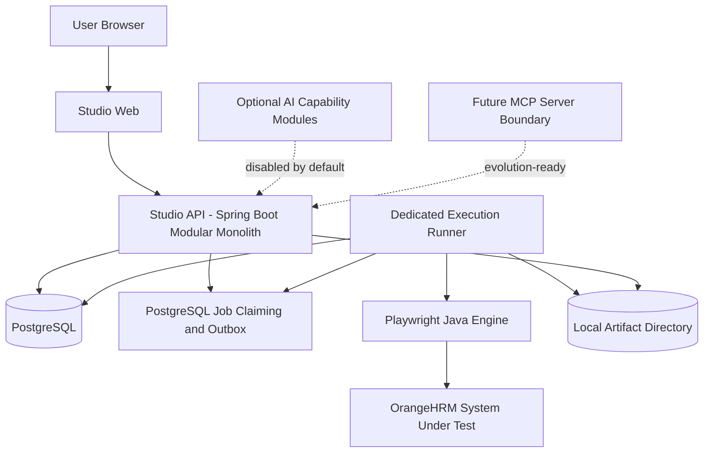
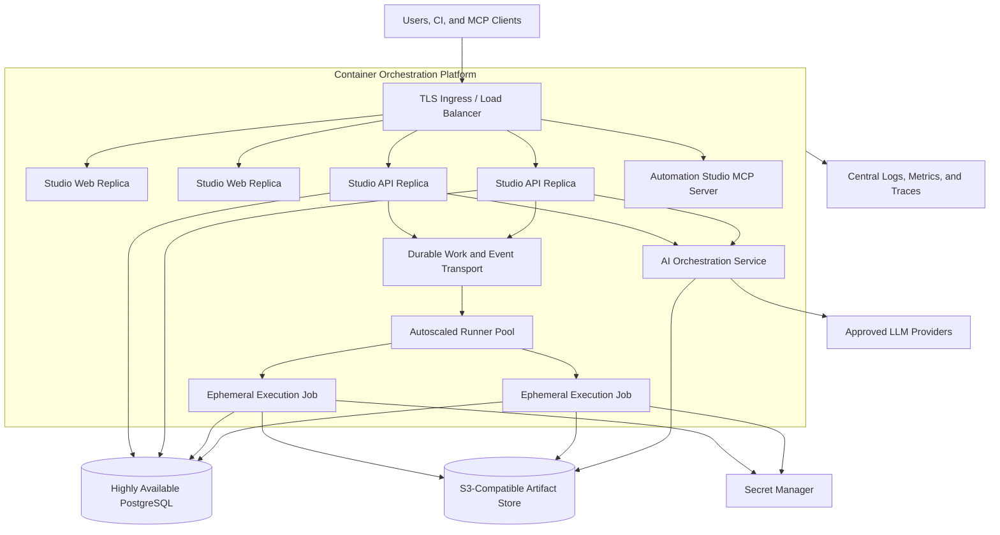

# Deployment Architecture

## Deployment Principles

Automation Studio is deployable as a small self-hosted platform first and can evolve toward enterprise deployment without changing its core boundaries.

- The control plane and execution runner are separate runtime processes.
- Web and API instances are stateless apart from external configuration.
- PostgreSQL is the authoritative metadata store.
- Artifact bytes are external to PostgreSQL behind an artifact-storage port.
- Secrets are provided by references and are not committed or persisted in execution history.
- AI and MCP are optional capabilities, not v0.1 deployment prerequisites.

## v0.1 Deployment Profile

v0.1 is intended for local development, demonstrations, and a small self-hosted installation. Docker Compose is acceptable, but this specification does not prescribe or create its implementation.

| Concern | v0.1 decision |
|---|---|
| Web application | One Next.js deployment |
| Control plane | One Spring Boot modular-monolith deployment |
| Execution | One dedicated Java runner process or container |
| Engine | Playwright Java plugin in the runner boundary |
| Metadata | One PostgreSQL instance |
| Work transport | PostgreSQL job claiming and transactional outbox |
| Artifacts | Local filesystem adapter through the artifact-storage port |
| AI | Disabled or optional; no provider required |
| MCP | Logical boundary only; no deployment required |
| Availability | Single-node operation is acceptable |

v0.1 does not require Kubernetes, a dedicated message broker, multi-tenancy, high availability, or a managed cloud service.

## Initial Runtime Topology

## Security and Configuration

- Use TLS for externally exposed services and production dependency connections where supported.
- Obtain user identities through an OIDC-compatible identity provider when authentication is introduced.
- Use scoped service identities for runners and future AI/MCP services.
- Store secret references in environment configuration, never secret values.
- Resolve a secret immediately before use, redact it from logs and artifacts, and remove it during workspace cleanup.
- Run execution workers without root privileges and with bounded workspace, CPU, memory, process, disk, and timeout limits.
- Do not mount host filesystems or use privileged execution containers.
- Generate signed, short-lived artifact access when an object-store adapter is introduced.

## Operational Requirements

All services should emit structured logs and include request, execution, attempt, and correlation identifiers where applicable. Useful initial metrics include execution queue depth, claim latency, runner health, execution duration, terminal outcomes, retry count, artifact volume, and database connection use.

The runner renews an execution lease through heartbeats. If it loses the lease, it must stop treating itself as eligible to finalize the attempt. A retry creates a new attempt while retaining prior attempt evidence.

Database schema changes, backup procedures, retention, and API definitions are intentionally specified in their respective future stories rather than this document.

## Enterprise Evolution Options

Possible later choices include an external broker, S3-compatible storage, managed PostgreSQL, autoscaled runners, separate AI and MCP deployments, private model endpoints, high availability, and multi-tenancy. These options must be adopted only when justified by scale, security, availability, or operational requirements.
