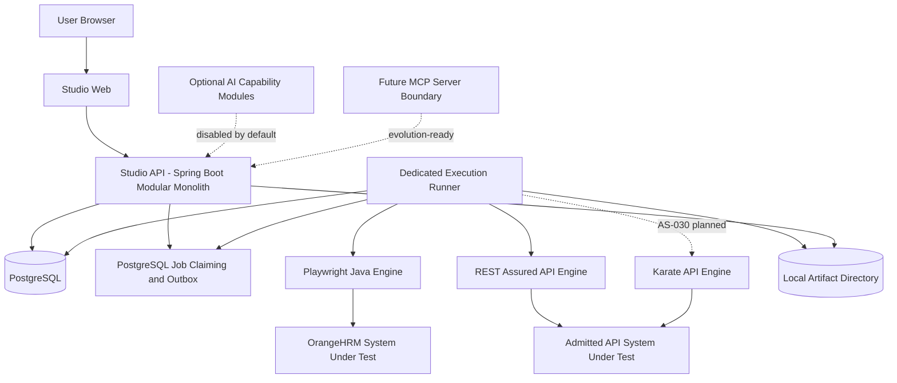
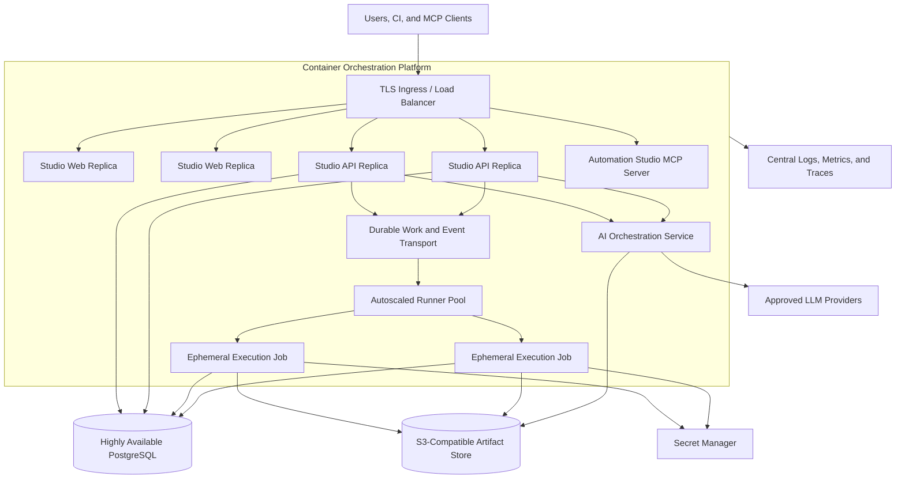

# Deployment Architecture

## Deployment Principles

Automation Studio is deployable as a small self-hosted platform first and can evolve toward enterprise deployment without changing its core boundaries.

- The control plane and execution runner are separate runtime processes.
- Web and API instances are stateless apart from external configuration.
- PostgreSQL is the authoritative metadata store.
- Artifact bytes must remain external to PostgreSQL behind an artifact-storage port; AS-028
  introduces that durable boundary, while PostgreSQL retains metadata only.
- Secrets are provided by references and are not committed or persisted in execution history.
- AI and MCP are optional capabilities, not v0.1 deployment prerequisites.

## v0.1 Deployment Profile

v0.1 is intended for local development, demonstrations, and a small self-hosted installation. Docker Compose is acceptable, but this specification does not prescribe or create its implementation.

| Concern | v0.1 decision |
|---|---|
| Web application | One Next.js deployment |
| Control plane | One Spring Boot modular-monolith deployment |
| Execution | One dedicated Java runner process or container |
| Engines | Statically assembled Playwright Java and REST Assured plugins; planned API-only Karate plugin in the same runner boundary |
| Metadata | One PostgreSQL instance |
| Work transport | PostgreSQL job claiming and transactional outbox |
| Artifacts | AS-028 local filesystem adapter through the artifact-storage port; bytes outside execution workspaces and metadata in PostgreSQL |
| AI | Disabled or optional; no provider required |
| MCP | Logical boundary only; no deployment required |
| Availability | Single-node operation is acceptable |

v0.1 does not require Kubernetes, a dedicated message broker, multi-tenancy, high availability, or a managed cloud service.

## Initial Runtime Topology

```mermaid
flowchart TB
    User[User Browser] --> Web[Studio Web]
    Web --> Api[Studio API - Spring Boot Modular Monolith]
    Api --> Db[(PostgreSQL)]
    Api --> Jobs[PostgreSQL Job Claiming and Outbox]
    Runner[Dedicated Execution Runner] --> Jobs
    Runner --> Db
    Runner --> Playwright[Playwright Java Engine]
    Runner --> RestAssured[REST Assured API Engine]
    Runner -. AS-030 planned .-> Karate[Karate API Engine]
    Playwright --> Sut[OrangeHRM System Under Test]
    RestAssured --> ApiSut[Admitted API System Under Test]
    Karate --> ApiSut
    Runner --> Files[(Local Artifact Directory)]
    Api --> Files

    Ai[Optional AI Capability Modules] -. disabled by default .-> Api
    Mcp[Future MCP Server Boundary] -. evolution-ready .-> Api
```

## Security and Configuration

- Use TLS for externally exposed services and production dependency connections where supported.
- Obtain user identities through an OIDC-compatible identity provider when authentication is introduced.
- Use scoped service identities for runners and future AI/MCP services.
- Store only secret references in platform-managed and durable configuration; never persist resolved
  secret values there.
- Resolve a secret lazily within one execution scope, keep it out of logs and artifacts, and release
  its owned value during deterministic scope cleanup.
- Run execution workers without root privileges and with bounded workspace, CPU, memory, process, disk, and timeout limits.
- Do not mount host filesystems or use privileged execution containers.
- Signed or public artifact access remains deferred and must be separately designed with any future
  object-store serving boundary.

Playwright artifact capture is disabled unless a suite explicitly sets
`captureFailureReport: true`. That setting emits only a bounded structural report after assertion
failure; it does not enable screenshots, traces, videos, page capture, or browser-network capture.

REST Assured targets only the environment's admitted HTTP/HTTPS origin. Production defaults deny
non-global destinations; operator policy may admit an exact non-global origin. Redirects, cookies,
implicit proxies, and TLS bypass remain disabled, credentials resolve per execution, and one
bounded sanitized structural report publishes through AS-028.

The planned AS-030 Karate v1 deployment is API-only and statically assembled. Admitted feature and
configuration files are trusted executable repository automation source, but remain subject to
runner CPU, memory, filesystem, process, egress, concurrency, and deadline controls. Java host
interop and child-process authority are prohibited. Outbound HTTP requires exact-origin and
address authorization, DNS-rebinding resistance, disabled implicit proxies, verified TLS, and
bounded redirects/resources. AS-030A does not add the runtime. It does not claim that the in-process
runner contains hostile tenant code; future hostile-source support requires separately approved
process/container isolation.

The Playwright runner provisioning, threat, failure-response, supported-platform, and release
checks are defined in [Playwright Execution Engine Production Readiness](playwright-production-readiness.md).
The Automation Studio runner process owns browser configuration and must receive
`automation.runner.playwright.executable-path=<absolute-path>` through the deployment environment
or configuration system, together with the approved workspace-root configuration. The value must
not appear in manifests or be committed as a machine-specific path. The runner does not discover,
download, or install a browser, and every deployment host or image requires configured real-browser
qualification.

The AS-025 `operator-environment` adapter is disabled by default and is available only when
`automation.runner.secrets.operator-environment.enabled=true` is supplied explicitly. Platform
snapshots and configuration continue to store references only. When this adapter is enabled, the
operator injects the referenced values into the runner process environment for execution-time lazy
resolution; this transient exposure depends on the host's process isolation, access controls, and
diagnostic hygiene. Injected values must not be committed, persisted, logged, copied into Maven
arguments, or included in results or evidence.

The operator-environment adapter is the bounded initial provider, not a general secret-manager
implementation. Production-grade external providers, provider administration, renewable leases,
and automated rotation remain deferred. After suspected exposure, remove or replace the affected
process environment, rotate the values through the operator-owned source, quarantine the runner as
needed, and requalify before returning it to service. AS-025 operator, threat, incident-response,
rollback, rotation, and release guidance is defined in the
[AS-025 Production Readiness Runbook](as-025-production-readiness-runbook.md).

## Operational Requirements

All services should emit structured logs and include request, execution, attempt, and correlation identifiers where applicable. Useful initial metrics include execution queue depth, claim latency, runner health, execution duration, terminal outcomes, retry count, artifact volume, and database connection use.

The runner renews an execution lease through heartbeats. If it loses the lease, it must stop treating itself as eligible to finalize the attempt. A retry creates a new attempt while retaining prior attempt evidence.

Database schema changes, backup procedures, retention, and API definitions are intentionally specified in their respective future stories rather than this document.

## Enterprise Evolution Options

```mermaid
flowchart TB
    Users[Users, CI, and MCP Clients] --> Ingress[TLS Ingress / Load Balancer]

    subgraph Platform[Container Orchestration Platform]
        Ingress --> WebA[Studio Web Replica]
        Ingress --> WebB[Studio Web Replica]
        Ingress --> ApiA[Studio API Replica]
        Ingress --> ApiB[Studio API Replica]
        ApiA --> Transport[Durable Work and Event Transport]
        ApiB --> Transport
        Transport --> RunnerPool[Autoscaled Runner Pool]
        RunnerPool --> JobA[Ephemeral Execution Job]
        RunnerPool --> JobB[Ephemeral Execution Job]
        ApiA --> AiService[AI Orchestration Service]
        ApiB --> AiService
        Ingress --> McpServer[Automation Studio MCP Server]
    end

    ApiA --> Metadata[(Highly Available PostgreSQL)]
    ApiB --> Metadata
    JobA --> Metadata
    JobB --> Metadata
    JobA --> ObjectStore[(S3-Compatible Artifact Store)]
    JobB --> ObjectStore
    AiService --> ObjectStore
    AiService --> Providers[Approved LLM Providers]
    JobA --> SecretManager[Secret Manager]
    JobB --> SecretManager
    Platform --> Telemetry[Central Logs, Metrics, and Traces]
```

Possible later choices include an external broker, S3-compatible storage, managed PostgreSQL, autoscaled runners, separate AI and MCP deployments, private model endpoints, high availability, and multi-tenancy. These options must be adopted only when justified by scale, security, availability, or operational requirements.
