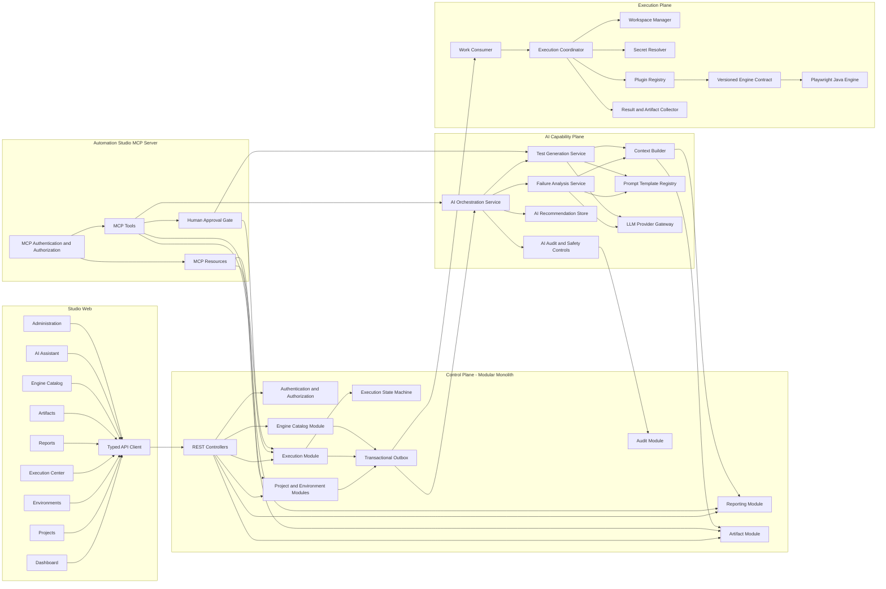

# Automation Studio Module Architecture

## Module Strategy

The initial control plane is a modular monolith. Modules are organized by business capability, own their application behavior, and communicate through explicit application interfaces or domain events. This keeps v0.1 practical while preserving the boundaries needed for later extraction.

The execution runner is a separate runtime boundary. Engine implementations are plugins behind a shared, versioned contract and do not become dependencies of control-plane domain modules.

## Control-Plane Modules

| Module | Responsibilities |
|---|---|
| Identity and Access | Authentication integration, authorization, roles, service identities, and audit actor resolution |
| Projects | Project lifecycle, membership, project settings, and source references |
| Environments | Environment configuration, secret references, and validation |
| Test Catalog | Test-suite definitions, source revision selection, and engine requirements |
| Executions | Admission, immutable snapshots, state transitions, cancellation intent, retry, and summaries |
| Engine Catalog | Registered engine versions, capabilities, compatibility, and health metadata |
| Reports | Read models, execution history, trends, and report summaries |
| Artifacts | Artifact metadata, authorization, retention policy, and storage-port access |
| Audit | Security and business audit events |
| Events | Transactional outbox, event publication, and consumer idempotency support |

No module may bypass another module's invariants by writing its persistence records directly.

## Execution-Plane Components

| Component | Responsibilities |
|---|---|
| Work Consumer | Claims durable work and prevents duplicate active processing |
| Execution Coordinator | Coordinates an execution attempt and guarded state changes |
| Workspace Manager | Creates, bounds, and cleans up an isolated execution workspace |
| Source Resolver | Retrieves the approved source revision |
| Secret Resolver | Resolves scoped secrets immediately before execution |
| Plugin Registry | Finds a compatible, approved engine plugin |
| Timeout and Cancellation Controller | Enforces execution limits and cooperative cancellation |
| Result and Artifact Collector | Normalizes events, persists results, and uploads evidence |
| Lease and Heartbeat Manager | Maintains runner ownership and detects abandoned work |

## Engine Plugin Contract

Each engine declares a stable engine identifier, implementation version, supported contract versions, capabilities, configuration schema, runtime requirements, entry point, and integrity metadata.

The required lifecycle operations are:

- Describe capabilities.
- Validate suite and engine configuration without side effects.
- Discover tests when the engine supports discovery.
- Execute a normalized request and emit normalized events.
- Cooperatively cancel an active execution.
- Report health.
- Release resources.

The normalized request includes execution and attempt identifiers, project workspace, source revision, selection, non-secret configuration, scoped secret material, artifact output path, timeouts, and requested capabilities. Plugins must not write platform database tables, make authorization decisions, select work independently, or resolve arbitrary platform secrets.

## AI Capability Modules

AI modules are optional in v0.1 and remain outside the authoritative execution path.

| Module | Responsibilities |
|---|---|
| AI Orchestration Service | Authorizes requests, selects workflows, coordinates analysis, and persists outcomes |
| LLM Provider Gateway | Provider-neutral model access, credentials, allowlists, limits, retries, and usage metadata |
| Prompt Template Registry | Immutable, reviewed template versions and expected output schemas |
| Context Builder | Builds minimum necessary, evidence-grounded, redacted context snapshots |
| Failure Analysis Service | Produces advisory summaries, possible causes, evidence, and uncertainty |
| Test Generation Service | Produces reviewable generation proposals, never direct repository commits |
| AI Recommendation Store | Stores recommendations separately from authoritative results |
| AI Audit and Safety Controls | Applies redaction, policy checks, output validation, provenance, and approval gates |

AI analysis is a separate operation. An AI outage, refusal, timeout, or invalid response is recorded as an analysis outcome and cannot alter the associated execution state.

## MCP Capability

The Automation Studio MCP Server is an integration adapter over application services. It is not a second business-logic implementation.

Initial MCP tools are designed to list projects, start executions, read results, retrieve authorized artifacts, and request AI analysis. MCP resources represent project metadata, execution history, and reports.

MCP authentication uses an OIDC-derived identity or scoped service identity. Tool and resource access applies the same project-scoped authorization as REST. Mutating or destructive operations require explicit human approval by default; agents cannot grant that approval themselves.

## Frontend Modules

The Studio Web application contains the following presentation modules:

- Dashboard
- Projects
- Environments
- Execution Center
- Reports
- Artifacts
- Engine Catalog
- AI Assistant
- Administration

The frontend presents API data and initiates authorized commands. It does not own execution state, security decisions, or AI safety controls.

## Component Diagram

## Dependency Rules

- Domain behavior does not depend on HTTP, frontend, ORM, message transport, artifact implementation, or engine implementation types.
- Controllers translate requests into application commands; they do not contain business rules.
- Modules access other capabilities through published application interfaces or events, not direct persistence access.
- The API does not import engine implementations.
- Engine plugins depend on the engine contract, not control-plane internals.
- AI modules access execution facts through authorized read interfaces and do not mutate execution aggregates.
- MCP tools use application services and never bypass authorization, audit, or human approval.
