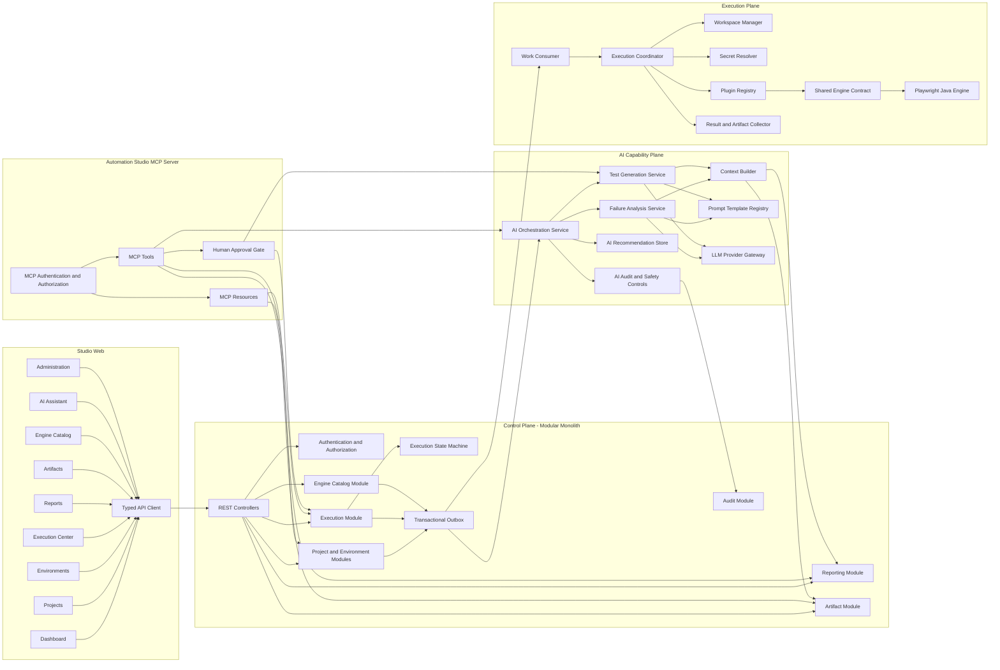

# Automation Studio Module Architecture

## Module Strategy

The initial control plane is a modular monolith. Modules are organized by business capability, own their application behavior, and communicate through explicit application interfaces or domain events. This keeps v0.1 practical while preserving the boundaries needed for later extraction.

The execution runner is a separate runtime boundary. Engine implementations are statically
Spring-registered plugins behind a shared contract and do not become dependencies of control-plane
domain modules. The current compatibility axis is exact engine implementation version; a separate
plugin-contract version is deferred by ADR-016.

## Control-Plane Modules

| Module | Responsibilities |
|---|---|
| Identity and Access | Authentication integration, authorization, roles, service identities, and audit actor resolution |
| Projects | Project lifecycle, membership, project settings, and repository-level source configuration |
| Environments | Environment configuration, secret references, and validation |
| Test Catalog | Test-suite definitions, repository-relative source location, and engine requirements |
| Executions | Admission, immutable source/configuration snapshots, state transitions, cancellation intent, retry, and summaries |
| Engine Catalog | Registered engine versions, capabilities, compatibility, and health metadata |
| Reports | Read models, execution history, trends, and report summaries |
| Artifacts | Artifact metadata, authorization, retention references, integrity, and storage-port access |
| Audit | Security and business audit events |
| Events | Transactional outbox, event publication, and consumer idempotency support |

No module may bypass another module's invariants by writing its persistence records directly.

## Execution-Plane Components

| Component | Responsibilities |
|---|---|
| Work Consumer | Claims durable work and prevents duplicate active processing |
| Execution Coordinator | Coordinates an execution attempt and guarded state changes |
| Workspace Manager | Creates, verifies, bounds, and idempotently cleans an isolated execution workspace beneath an operator-controlled root |
| Source Resolver | Materializes and verifies the admitted exact source revision without engine or persistence knowledge |
| Secret Resolver | Resolves scoped secrets immediately before execution |
| Plugin Registry | Finds a compatible, approved engine plugin |
| Timeout and Cancellation Controller | Enforces execution limits and cooperative cancellation |
| Result and Artifact Collector | Normalizes results and publishes validated evidence through the platform-owned artifact boundary |
| Lease and Heartbeat Manager | Maintains runner ownership and detects abandoned work |

Workspace preparation starts only after fenced execution start commits. Source retrieval,
filesystem work, engine invocation, and cleanup remain outside database transactions. The
Workspace Manager alone controls host paths and deletion. The Source Resolver receives an
immutable source identity and manager-owned destination; the engine receives only immutable
prepared-workspace details. Runner-local directories are never authoritative execution state.

The initial durable source type is a policy-approved credential-free Git HTTPS repository at an
exact commit, plus an optional bounded Suite-owned repository-relative location. Project owns
repository configuration, including the currently approved commit, and Execution snapshots the
resolved identity. See ADR-013.

## Engine Plugin Contract

The current repository contract requires each engine to declare a stable case-sensitive
`engineId`, exact `implementationVersion`, display name, and immutable capability/feature sets.
Configuration/runtime requirements remain provider-owned behind the shared contract. Separate
plugin-contract versions, package entry-point metadata, and integrity metadata are future SDK or
external-plugin decisions, not current descriptor fields. See ADR-016.

The required lifecycle operations are:

- Describe capabilities.
- Validate suite and engine configuration without side effects.
- Execute a normalized prepared request and return a normalized result.
- Close invocation resources acquired by the engine in deterministic reverse order.

The current canonical `EngineExecutionRequest` includes one immutable execution context, completed
source/workspace preparation, narrow execution-matched secret access, and the AS-028 artifact
publisher. Cancellation, health, and discovery require later approved contracts. Plugins must not
write platform database tables, make authorization decisions, select work independently, delete
physical workspaces, or resolve arbitrary platform secrets.

AS-027 implements the reusable module boundary approved in AS-027A. The production SDK is
Spring-free and JDK-only. It exposes a
projected immutable engine context and narrow execution-bound workspace/secret capabilities rather
than platform orchestration, persistence, preparation, provider, or lifecycle implementations.

The approved dependency direction is:

```text
engine-plugin-sdk
        ^
        |
studio-api

engine-plugin-sdk
        ^
        |
engine-plugin-conformance
```

The sample engine depends on `engine-plugin-sdk`, and its tests depend on
`engine-plugin-conformance`. The reactor layout is a root aggregator with
`engines/engine-plugin-sdk`, `engines/engine-plugin-conformance`,
`engines/sample-engine-plugin`, and `backend/studio-api`. AS-027B created the SDK, AS-027C created
the reusable conformance module, AS-027D migrated Builtin and Playwright, and AS-027E created the
non-production sample.

The intended reusable `ExecutionEnginePlugin` interface conceptually centers on `descriptor()`,
`validate(EngineExecutionContext)`, and `execute(EngineExecutionRequest)`. The current platform
`ExecutionEngine` may temporarily bridge this contract. Deprecated `execute(ExecutionContext)`
remains platform compatibility behavior and is not the SDK onboarding model. The platform retains
one authoritative registry and one controlled execution path.

Workspace capability design keeps physical roots, provider infrastructure, deletion, and the
platform-local resolver internal. AS-027B implemented bounded repository-relative stream access
without public raw `Path`. Secret capability design permits execution-correlated logical-name
resolution only and keeps providers, registries, credentials, scopes, and persistence internal.
In-process plugins remain trusted deployed code; the SDK boundary is not runtime isolation.

AS-028 defines the artifact boundary that follows engine execution. Engines publish declared
evidence through a narrow SDK capability; they do not return host paths, choose durable locations,
or access persistence and storage adapters. The platform owns bounded staging, category and media
type validation, SHA-256 integrity calculation, durable byte storage outside execution workspaces,
PostgreSQL metadata, discovery authorization, and cleanup. AS-028 implements this path with a local
durable adapter and an execution-scoped publisher. Playwright proves opt-in bounded failure-report
publication; Builtin and sample engines remain valid without artifacts.

AS-029 introduces a planned `rest-assured-engine-plugin` as a sibling engine module depending on
the JDK-only SDK. REST Assured and API-manifest types remain private to that module; the SDK and
platform domains do not depend on them. `studio-api` may assemble the engine statically into the
existing registry and supplies only the existing prepared workspace, execution-scoped secret, and
artifact capabilities. The engine creates no registry, orchestrator, lifecycle, persistence, or
network-policy authority outside its bounded invocation.

## AI Capability Modules

AI modules are optional in v0.1 and remain outside the authoritative execution path.

| Module | Responsibilities |
|---|---|
| AI Orchestration Service | Authorizes requests, selects workflows, coordinates analysis, and persists outcomes |
| LLM Provider Gateway | Provider-neutral model access, credentials, allowlists, limits, retries, and usage metadata |
| Prompt Template Registry | Immutable, reviewed template versions and expected output schemas |
| Context Builder | Builds minimum necessary, evidence-grounded, redacted context snapshots |
| Failure Analysis Service | Produces advisory summaries, possible causes, evidence, and uncertainty |
| Test Generation Service | Produces reviewable generation proposals, never direct repository commits |
| AI Recommendation Store | Stores recommendations separately from authoritative results |
| AI Audit and Safety Controls | Applies redaction, policy checks, output validation, provenance, and approval gates |

AI analysis is a separate operation. An AI outage, refusal, timeout, or invalid response is recorded as an analysis outcome and cannot alter the associated execution state.

## MCP Capability

The Automation Studio MCP Server is an integration adapter over application services. It is not a second business-logic implementation.

Initial MCP tools are designed to list projects, start executions, read results, retrieve authorized artifacts, and request AI analysis. MCP resources represent project metadata, execution history, and reports.

MCP authentication uses an OIDC-derived identity or scoped service identity. Tool and resource access applies the same project-scoped authorization as REST. Mutating or destructive operations require explicit human approval by default; agents cannot grant that approval themselves.

## Frontend Modules

The Studio Web application contains the following presentation modules:

- Dashboard
- Projects
- Environments
- Execution Center
- Reports
- Artifacts
- Engine Catalog
- AI Assistant
- Administration

The frontend presents API data and initiates authorized commands. It does not own execution state, security decisions, or AI safety controls.

## Component Diagram


```mermaid
flowchart LR
    subgraph WEB[Studio Web]
        Dashboard[Dashboard]
        Projects[Projects]
        Environments[Environments]
        ExecutionCenter[Execution Center]
        Reports[Reports]
        ArtifactsUi[Artifacts]
        EngineCatalogUi[Engine Catalog]
        AiAssistant[AI Assistant]
        Administration[Administration]
        ApiClient[Typed API Client]

        Dashboard --> ApiClient
        Projects --> ApiClient
        Environments --> ApiClient
        ExecutionCenter --> ApiClient
        Reports --> ApiClient
        ArtifactsUi --> ApiClient
        EngineCatalogUi --> ApiClient
        AiAssistant --> ApiClient
        Administration --> ApiClient
    end

    subgraph CONTROL[Control Plane - Modular Monolith]
        Rest[REST Controllers]
        Auth[Authentication and Authorization]
        ProjectModule[Project and Environment Modules]
        ExecutionModule[Execution Module]
        EngineModule[Engine Catalog Module]
        ReportingModule[Reporting Module]
        ArtifactModule[Artifact Module]
        AuditModule[Audit Module]
        StateMachine[Execution State Machine]
        Outbox[Transactional Outbox]

        Rest --> Auth
        Rest --> ProjectModule
        Rest --> ExecutionModule
        Rest --> EngineModule
        Rest --> ReportingModule
        Rest --> ArtifactModule
        ExecutionModule --> StateMachine
        ProjectModule --> Outbox
        ExecutionModule --> Outbox
        EngineModule --> Outbox
    end

    subgraph EXECUTION[Execution Plane]
        WorkConsumer[Work Consumer]
        Coordinator[Execution Coordinator]
        Workspace[Workspace Manager]
        Secrets[Secret Resolver]
        Registry[Plugin Registry]
        Collector[Result and Artifact Collector]
        Contract[Shared Engine Contract]
        Playwright[Playwright Java Engine]

        WorkConsumer --> Coordinator
        Coordinator --> Workspace
        Coordinator --> Secrets
        Coordinator --> Registry
        Coordinator --> Collector
        Registry --> Contract
        Contract --> Playwright
    end

    subgraph AI[AI Capability Plane]
        Orchestrator[AI Orchestration Service]
        Context[Context Builder]
        Prompts[Prompt Template Registry]
        Gateway[LLM Provider Gateway]
        Analysis[Failure Analysis Service]
        Generation[Test Generation Service]
        Recommendations[AI Recommendation Store]
        Safety[AI Audit and Safety Controls]

        Orchestrator --> Safety
        Orchestrator --> Analysis
        Orchestrator --> Generation
        Analysis --> Context
        Generation --> Context
        Analysis --> Prompts
        Generation --> Prompts
        Analysis --> Gateway
        Generation --> Gateway
        Orchestrator --> Recommendations
    end

    subgraph MCP[Automation Studio MCP Server]
        McpAuth[MCP Authentication and Authorization]
        McpTools[MCP Tools]
        McpResources[MCP Resources]
        Approval[Human Approval Gate]
        McpAuth --> McpTools
        McpAuth --> McpResources
        McpTools --> Approval
    end

    ApiClient --> Rest
    Outbox --> WorkConsumer
    Outbox --> Orchestrator
    McpTools --> ProjectModule
    McpTools --> ExecutionModule
    McpTools --> Orchestrator
    McpResources --> ReportingModule
    McpResources --> ArtifactModule
    Approval --> ExecutionModule
    Approval --> Generation
    Context --> ReportingModule
    Context --> ArtifactModule
    Safety --> AuditModule
```

## Dependency Rules

- Domain behavior does not depend on HTTP, frontend, ORM, message transport, artifact implementation, or engine implementation types.
- Controllers translate requests into application commands; they do not contain business rules.
- Modules access other capabilities through published application interfaces or events, not direct persistence access.
- The API does not import engine implementations.
- Engine plugins depend on the engine contract, not control-plane internals.
- AI modules access execution facts through authorized read interfaces and do not mutate execution aggregates.
- MCP tools use application services and never bypass authorization, audit, or human approval.
