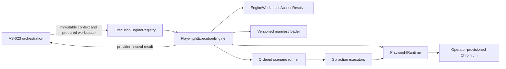

# Playwright Execution Engine Production Readiness

## Scope and Release Boundary

This runbook covers the `playwright-java` engine at version `1.61.0`. It is the AS-024H
production-readiness and final-documentation baseline. It does not add runtime behavior.

Supported behavior is intentionally narrow: operator-provisioned Chromium, headless execution,
one non-persistent browser context and page per execution, schema `1.0` manifests, the six approved
actions, same-origin HTTP/HTTPS navigation, and internal transient metrics. Firefox, WebKit,
headed or persistent profiles, browser installation, artifacts, retries, cancellation, parallel
scenarios, new APIs, and metrics persistence remain out of scope.

## Runtime Topology and Ownership



Orchestration owns claims, leases, status persistence, source preparation, and physical workspace
release. The engine owns manifest validation, its browser lifecycle, ordered action execution,
sanitized result mapping, and closing its workspace access handle. It never deletes or releases
the prepared workspace.

Cleanup order is page, browser context, browser, Playwright, then workspace access. Cleanup failure
takes precedence and retains an earlier failure only as internal suppressed context.

## Operator Provisioning

The operator must install and patch a Chromium-compatible executable independently of Automation
Studio. Automation Studio never searches for, downloads, or installs a browser.

Maven resolves the pinned Java dependency `com.microsoft.playwright:playwright:1.61.0`; dependency
resolution does not provision Chromium. No Playwright browser installer and no npm, npx, shell, or
runtime download flow exists. The operator supplies, attests, patches, and governs the browser
binary. Compatibility with an arbitrary operator build is not guaranteed until the configured
real-browser qualification passes.

Configure an absolute executable path through:

```text
automation.runner.playwright.executable-path
```

For Spring Boot environment binding, use:

```text
AUTOMATION_RUNNER_PLAYWRIGHT_EXECUTABLE_PATH
```

The path is host-specific configuration. Do not commit it, place it in manifests, return it in API
results, or write it to logs. The runner identity must have execute permission for the file. The
optional `automation.runner.playwright.browser-startup-timeout` defaults to `PT1M`, must be positive,
and cannot exceed `PT5M`.

Before enabling a runner:

1. Confirm Playwright Java and engine identity are both exactly `1.61.0`.
2. Provision a Chromium executable compatible with that Playwright release.
3. Run the configured real-browser verification below on the target runner image or host.
4. Confirm the runner can reach only the systems under test permitted by deployment policy.
5. Run the runner as a non-root identity without a persistent browser profile or broad host mounts.
6. Keep browser patching, vulnerability response, and executable replacement in operator change control.

## Supported-Platform Evidence

The committed AS-024G evidence verifies one Windows runner host using its explicitly configured,
operator-provisioned Google Chrome executable with eight real-browser tests. This does not establish
general Windows or Chromium compatibility. Qualification applies to the complete combination of
operating system, runner host or container image, CPU architecture, Chrome versus Chromium product,
browser build and package source, Java runtime, and Playwright Java version.

Every distinct combination must pass the configured suite before support is claimed. Alternate
Windows Chrome or Chromium packages, alternate Chromium builds, Linux hosts, Linux containers,
macOS, ARM and other CPU architectures, Firefox, and WebKit remain unqualified. Headed operation,
branded Playwright channels, and persistent profiles are unsupported.

## Threat Review

| Threat | Implemented control | Residual/operator responsibility |
|---|---|---|
| Malformed manifest JSON | Strict Jackson parsing fails with a fixed malformed-manifest classification | Correct repository input without logging its content |
| Duplicate JSON keys | Strict duplicate-key detection rejects ambiguous objects | Do not preprocess manifests with a parser that discards duplicates |
| Unsupported manifest schema | Exact local schema version `"1.0"`; no negotiation or network lookup | Introduce future versions only through an approved compatibility review |
| Oversized manifest input | Loader caps the manifest at 1 MiB before parsing | Retain filesystem and workspace quotas |
| Excessive JSON nesting | Parser nesting constraints fail closed | Do not relax parser constraints per repository |
| Path traversal | Repository-relative validation rejects `..` traversal | Keep source preparation and workspace permissions controlled |
| Absolute-path injection | Absolute manifest locations are rejected | Never translate repository input into host paths |
| Symbolic-link escape | Candidate and ancestor link checks reject linked paths | Link creation may be platform-restricted; retain the established skip review |
| Canonical workspace escape | Canonical containment checks keep the manifest beneath prepared source | Protect the workspace root from external mutation |
| Workspace-access misuse | Engine receives paths only through `EngineWorkspaceAccessResolver` | Orchestration remains preparation and physical-release owner |
| CSS selector strategy bypass | All selector actions use the centralized CSS-only `SelectorResolver` | Review any future selector strategy separately |
| Explicit XPath selector use | `xpath=` and `*xpath=` forms are rejected | Do not enable Playwright selector engines directly |
| Implicit XPath prefixes | `//` and `..` selector prefixes are rejected | Keep the CSS grammar fail-closed |
| Playwright selector-engine syntax or chaining | Internal engines, `>>`, and unsupported prefixes are rejected | Do not bypass the resolver in new executors |
| Variable recursion or cycles | Bounded `NonSecretVariableInterpolator` rejects recursive and cyclic definitions | Keep variable count, name, and expansion limits |
| Secret-value resolution or fallback | Only explicit non-secret immutable variables are accepted; secret references are not resolved | Do not place secrets in variables or manifests |
| Environment or system-property fallback | Interpolation consults neither environment variables nor system properties | The executable property is test/operator configuration, not scenario interpolation |
| Same-origin bypass | Normalized HTTP/HTTPS scheme, host, and effective-port comparison fails closed | Restrict runner egress as defense in depth |
| Cross-origin redirect escape | Redirect destinations are validated against the approved origin | Do not weaken redirect validation for target compatibility |
| Final redirected URL escape | Runtime returns the final URI and policy validates it after navigation | Preserve post-navigation validation in future runtime adapters |
| Browser executable substitution | Absolute operator-owned path; scenarios cannot select or override it | Attest the binary and protect the configuration channel |
| Raw SDK diagnostic leakage | Fixed sanitized engine codes and messages wrap internal causes | Restrict internal diagnostics to authorized operators |
| Sensitive path, selector, value, or assertion leakage | Provider-neutral results and public failures omit execution details | Apply the logging prohibitions below |
| Browser process or resource leakage | One execution-scoped session with reverse-order page/context/browser/Playwright cleanup | Quarantine a runner after cleanup failure |
| Excessive resource consumption | Bounded inputs, actions, timeouts, viewport, startup, and one-page lifecycle | Enforce host CPU, memory, disk, process, and concurrency limits |
| Arbitrary code execution | Declarative actions only; no customer Java compilation or class loading | Review all future actions and manifests as code-execution boundaries |
| Shell or process invocation | Engine invokes no Maven, Gradle, npm, shell, `ProcessBuilder`, or runtime process API | Keep installers and operator tooling outside execution requests |
| External-network access | Same-origin engine policy; real-browser qualification uses loopback only | Deployment egress policy defines which systems under test are reachable |

## Residual Risks and Support Limitations

Implemented guarantees are the fail-closed controls described above. The following are residual
risks, operator responsibilities, or deferred capabilities—not implemented production guarantees:

- Compatibility between Playwright Java `1.61.0` and an operator-supplied browser build is proven
  only by qualification of that exact combination.
- Browser provenance, patching, vulnerability response, and replacement are operator-owned.
- Host-level Chromium sandbox behavior, OS-specific launch behavior, runner-image differences,
  CPU architecture, and alternate Chrome/Chromium distributions remain deployment-dependent.
- Memory and CPU behavior under production load has not been performance or capacity qualified.
- AS-024 provides no cancellation contract and no retry behavior.
- Screenshots, tracing, video, artifact collection, and artifact publication are absent.
- Internal metrics are transient and are not persisted, exposed through REST, or reported in dashboards.
- Scenarios execute sequentially; bounded parallel scenario execution is not implemented.
- Only the initial six actions are supported. Firefox and WebKit are unsupported.
- Broader Linux, container, macOS, alternate-Windows, ARM, and other platform combinations are
  unqualified until their exact combinations pass real-browser qualification.
- The symbolic-link manifest test remains skipped on platforms where link creation is unavailable.

## Operational Failure Guidance

Public engine classifications are intentionally sanitized. Infrastructure failures return no
`EngineExecutionResult`; cleanup failure also prevents result return and takes precedence under
ADR-014. Assertion mismatch alone maps to provider-neutral `FAILED`. Operators use stable codes and
fixed public messages. Raw cause text is retained internally only and must not be exposed.

| Classification | Operator action |
|---|---|
| `INVALID_PLAYWRIGHT_EXECUTION_REQUEST` | Validate required immutable request, context, preparation, and identity fields |
| `UNSUPPORTED_PLAYWRIGHT_ENGINE` | Verify immutable engine name/version and runner capability registration |
| `PLAYWRIGHT_CONFIGURATION_INVALID` | Validate approved immutable settings and bounds; do not echo submitted values |
| `PLAYWRIGHT_WORKSPACE_ACCESS_FAILED` | Check preparation state, workspace ownership, containment, and runner filesystem permissions |
| `PLAYWRIGHT_MANIFEST_LOAD_FAILED` | Validate repository-relative location, schema `1.0`, file bounds, and link/path restrictions |
| `PLAYWRIGHT_RUNTIME_START_FAILED` | Verify executable availability/compatibility and startup timing; restricted causes may include `STARTUP_TIMING_INVALID` |
| `PLAYWRIGHT_ACTION_EXECUTION_FAILED` | Check restricted internal diagnostics for timeout, interpolation, selector, or same-origin rejection |
| `PLAYWRIGHT_RUNTIME_EXECUTION_FAILED` | Treat as browser/runtime infrastructure failure; verify host capacity and browser compatibility |
| `PLAYWRIGHT_METRICS_INVALID` | Treat as an internal metrics invariant failure; do not reconstruct or publish partial metrics |
| `PLAYWRIGHT_OUTCOME_INVALID` | Treat as an internal terminal-outcome invariant failure; no result is valid |
| `PLAYWRIGHT_RESULT_INVALID` | Treat as an internal provider-neutral result invariant failure; no result is valid |
| `PLAYWRIGHT_EXECUTION_FAILED` | Treat as an unexpected execution/integration boundary failure and use restricted diagnostics |
| `PLAYWRIGHT_RUNTIME_CLEANUP_FAILED` | Quarantine the affected runner if browser resources may remain; investigate before returning it to service |
| `PLAYWRIGHT_WORKSPACE_ACCESS_CLEANUP_FAILED` | Investigate the access-handle failure; physical workspace release remains orchestration-owned |
| provider-neutral `FAILED` result | Expected assertion mismatch, not infrastructure failure; do not retry automatically |

No AS-024 retry or cancellation policy is implied. Operators must not convert infrastructure
exceptions into successful or assertion-failed results.

Externally visible logs and public errors must not contain Chromium executable paths, workspace
roots or source paths, manifest paths or raw manifest content, selectors, sensitive URLs, fill or
variable values, expected or actual assertion text, tokens, credentials, cookies, headers, page
content, browser stdout/stderr, raw Playwright diagnostics, or full exception cause chains. The
approved operational surface is **fixed lifecycle messages plus stable sanitized failure codes**.
Internal cause retention is not permission to expose a cause publicly.

## Verification Gates

Run commands from `backend/studio-api`.

Ordinary compile and full suite (does not launch a browser when the property is absent):

```powershell
cd backend/studio-api
mvn -DskipTests compile
mvn test
```

Focused non-browser Playwright regression:

```powershell
cd backend/studio-api
mvn -Dtest=PlaywrightExecutionEngineTest,PlaywrightExecutionEngineSanitizationTest,PlaywrightExecutionEngineRegistrationTest,PlaywrightScenarioManifestLoaderTest,PlaywrightActionSecurityComponentsTest,PlaywrightActionExecutorsTest,PlaywrightOrderedScenarioRunnerTest,DefaultPlaywrightRuntimeTest,PlaywrightRuntimeBoundaryTest test
```

The repository class is `PlaywrightActionExecutorsTest` (plural); it replaces the singular class
name used in the review example.

Target-platform real-browser qualification:

```powershell
cd backend/studio-api
mvn -Dautomation.runner.playwright.executable-path="<absolute-operator-chromium-path>" -Dtest=PlaywrightRealBrowserRuntimeTest,PlaywrightExecutionEngineEndToEndTest test
```

The executable path must never be committed. Without it, seven browser-dependent tests skip by
assumption and the invalid-path test continues to run. No verification command installs a browser.

## Release Checklist

### Source and review

- [ ] Working tree is clean, contains no unrelated changes, and the feature branch is synchronized.
- [ ] An approved commit exists and the independent review verdict is recorded.

### Build and tests

- [ ] Compilation, the nine-class focused gate, and the ordinary full suite pass.
- [ ] The configured real-browser suite passes on the exact target host or image.
- [ ] Known skips are reviewed and accepted; no unexpected Surefire dump, failure, or error exists.

### Browser provisioning

- [ ] `automation.runner.playwright.executable-path` is configured on the runner and is absolute.
- [ ] The executable exists and the runner identity has permission to execute it.
- [ ] Browser product, build, and package source are recorded for the qualified target.
- [ ] No installer/download step exists; browser provenance, patching, and vulnerability ownership are assigned.

### Runtime configuration

- [ ] The approved workspace root is configured and operator properties satisfy supported bounds.
- [ ] Manifests cannot override browser controls and no machine-specific path is committed.

### Platform qualification

- [ ] OS, runner image/host, CPU architecture, browser product/build/package, Java version, and
  Playwright Java version are recorded and qualified together.

### Security

- [ ] Public logs contain no executable/workspace paths, selectors, values, assertion text, tokens,
  cookies, headers, page content, or SDK diagnostics.
- [ ] No external-network runtime dependency, installer, or process-execution path exists.

### Operations and release

- [ ] Loopback qualification or an explicitly approved target-system test is identified.
- [ ] Resource limits and capacity assumptions are reviewed; residual risks are explicitly accepted.
- [ ] A rollback plan identifies the prior browser package and runner configuration.
- [ ] Unsupported-platform/readiness claims are avoided and the target environment owner signs off.
- [ ] No screenshot, trace, video, report, artifact, or persistent profile is enabled.
- [ ] AS-024H receives independent review before AS-024 is declared complete.
