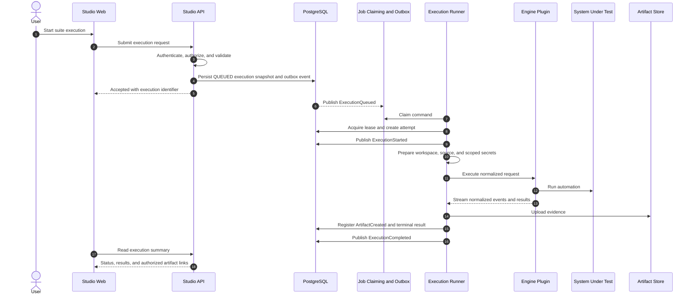
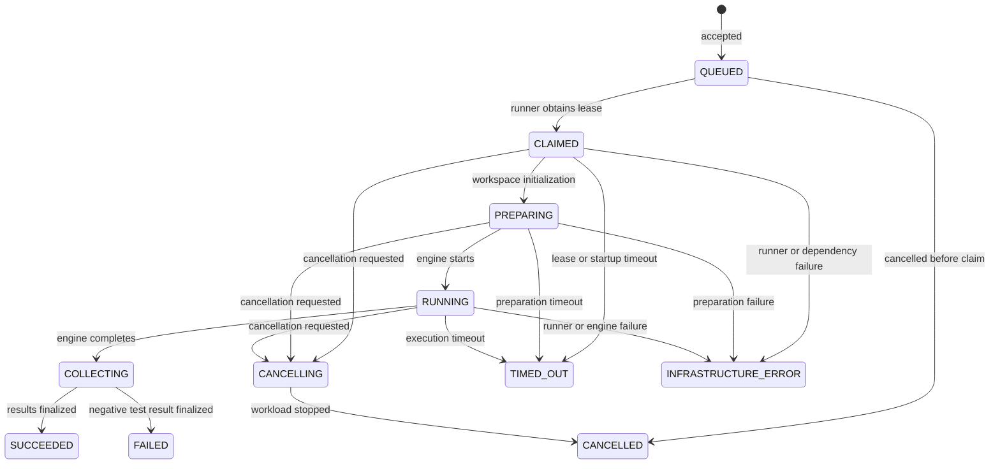
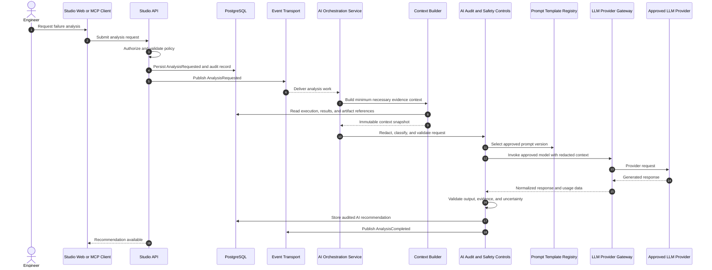
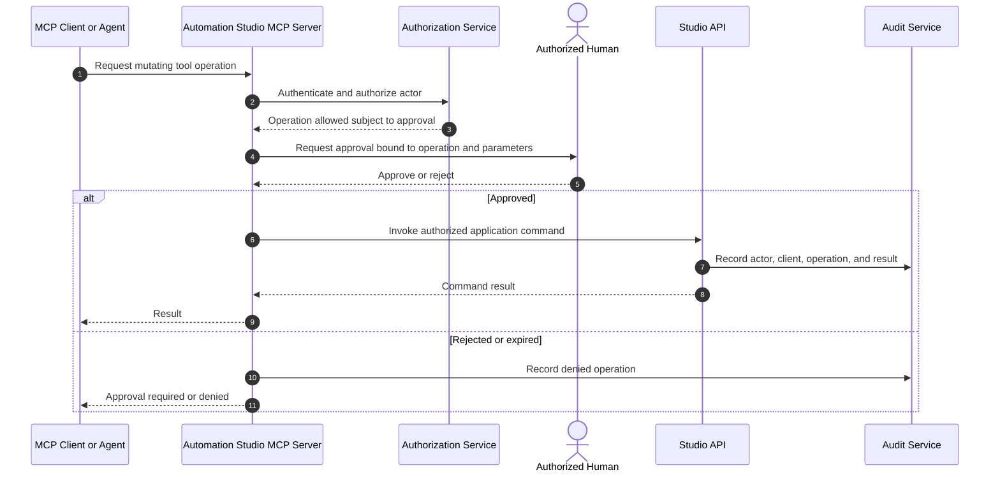

# Sequence Diagrams

## Execution Lifecycle

An execution is asynchronous. The API accepts a validated request, persists an immutable execution snapshot, and returns an execution identifier. Test work is performed by the dedicated runner, never by an HTTP request thread.

## Execution State Model

Terminal states are `SUCCEEDED`, `FAILED`, `CANCELLED`, `TIMED_OUT`, and `INFRASTRUCTURE_ERROR`. `FAILED` means automation completed with a negative test outcome. `INFRASTRUCTURE_ERROR` means the platform could not reliably determine the intended test outcome.

## Advisory AI Failure Analysis

AI analysis is initiated after an authorized request. It consumes evidence and produces a recommendation without changing execution status or result data.

The analysis path is optional. Provider unavailability, rejected content, or invalid model output results in an analysis failure record and never changes the associated execution outcome.

## MCP Mutation Approval

Read-only MCP tools and resources still require normal authentication, authorization, and audit. Secret values are not available through MCP.
