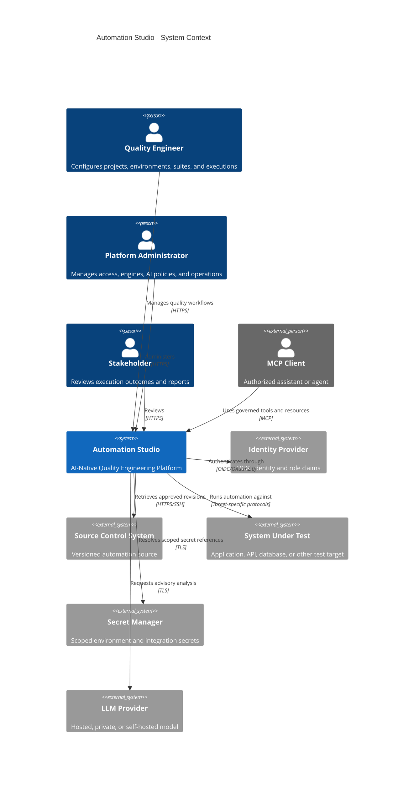
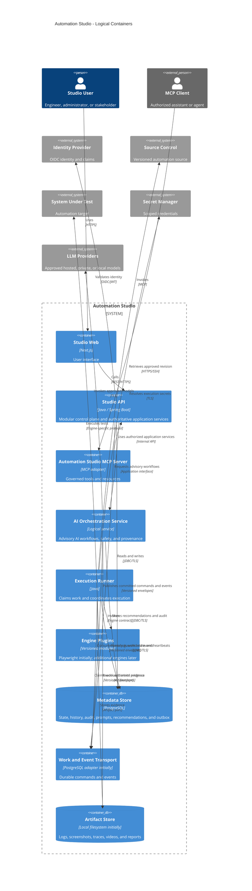

# Automation Studio System Architecture

## Purpose

Automation Studio is an AI-Native Quality Engineering Platform for managing automation projects, environments, execution, evidence, reports, and AI-assisted quality-engineering workflows.

AI-native means the platform has explicit AI domain, security, audit, and integration boundaries. It does not make the core automation path dependent on an AI provider. In v0.1, a user can run an OrangeHRM Playwright smoke suite, collect evidence, and review the result without AI being enabled.

## Architecture Goals

- Keep control-plane responsibilities separate from automation execution.
- Support independent automation technologies through a versioned engine contract.
- Provide durable, asynchronous, observable execution.
- Preserve immutable, reproducible execution history and evidence metadata.
- Keep secrets as references and resolve them only for a scoped execution.
- Make AI advice evidence-grounded, auditable, and non-authoritative.
- Provide an evolution path for MCP clients and enterprise deployment.

## Design Principles

1. Simplicity over premature optimization.

2. Clear ownership boundaries.

3. AI assists but does not own execution.

4. Contract-first integrations.

5. Security by default.

6. Observable systems.

7. Modular evolution over framework coupling.

## Non Goals

v0.1 is not intended to:

- Replace Jenkins

- Replace GitHub Actions

- Replace TestRail

- Become a Kubernetes platform

- Provide AI autonomy

- Automatically modify source code

## Add Guiding Philosophy
Automation Studio is designed to evolve from a single-developer open-source project into an enterprise-grade quality engineering platform.
The architecture intentionally separates today's implementation decisions from tomorrow's scalability decisions.

## Logical Planes

| Plane | Responsibility | v0.1 implementation |
|---|---|---|
| Control plane | Projects, environments, suites, scheduling, results, reports, access control, audit, and event publication | Spring Boot modular monolith |
| Execution plane | Work claiming, workspace preparation, secret resolution, engine invocation, cancellation, evidence, and cleanup | Dedicated Java runner with Playwright Java engine |
| AI capability plane | Context, prompts, provider access, analysis, recommendations, and safety controls | Evolution-ready interfaces; no mandatory provider |
| Integration plane | Web, REST, CI, and MCP access to governed services | Web and REST in v0.1; MCP boundary reserved for later |

The control plane owns authoritative business state. The execution plane may report results, but it does not change project configuration or authorization rules. The AI capability plane produces recommendations only; it cannot alter authoritative execution outcomes or history.

# Quality Attributes

Availability

Maintainability

Extensibility

Observability

Security

Performance

Portability

Auditability

## Architecture Constraints
Java 21

Spring Boot

PostgreSQL

Next.js

Docker

Playwright Java

Maven
## System Context

## Logical Containers

The MCP Server and AI Orchestration Service are logical boundaries. They may be implemented as modules deployed with the API initially, then separated when traffic, security isolation, or operational requirements justify it.

## Core Domain Concepts

The authoritative domain includes Project, Environment, Test Suite, Test Case, Engine, Engine Version, Execution, Execution Attempt, Test Result, Step Result, Artifact, Execution Event, and Audit Event.

An execution stores immutable snapshots of the selected suite revision, non-secret environment configuration, engine version, and relevant runtime configuration. Secret values are never included in these snapshots.

The AI domain adds Analysis Request, Context Snapshot, Prompt Template, Model Invocation, AI Recommendation, Generation Proposal, Approval Decision, and AI Safety Event. These records reference authoritative facts; they do not replace or mutate them.

## Event Architecture

Events decouple execution, reporting, AI analysis, and future integrations. The initial implementation uses a PostgreSQL transactional outbox and durable job claiming. An external broker is an optional later adapter.

| Event | Meaning |
|---|---|
| `ProjectCreated` | A project was created. |
| `EnvironmentConfigured` | An environment was created or materially updated. |
| `ExecutionQueued` | An execution was accepted for processing. |
| `ExecutionStarted` | A runner began an execution attempt. |
| `ExecutionCompleted` | An execution reached a terminal state. |
| `ArtifactCreated` | Evidence was stored and registered. |
| `AnalysisRequested` | An authorized AI analysis was requested. |
| `AnalysisCompleted` | Analysis completed or failed. |
| `EngineRegistered` | An engine version became available. |

Events include an event identifier, schema version, aggregate identifier, project identifier where applicable, correlation identifier, causation identifier, actor, occurrence time, and non-secret payload. Consumers are idempotent because delivery is at least once.

## AI and MCP Safety Boundaries

- AI output is advisory and must not change authoritative test outcomes.
- Sensitive data is redacted before model invocation.
- Every invocation records the model, provider, prompt version, input references, output, and safety decisions.
- Recommendations include evidence references and uncertainty.
- Generated tests and fixes remain proposals until an authorized human approves them.
- MCP tools invoke the same application services and authorization rules as the web and REST interfaces.
- Mutating or destructive MCP actions, including agent-started executions, cancellation, and proposal approval, require explicit human approval by default.
- Secret values are never exposed through MCP tools or resources.

## v0.1 Scope and Evolution

v0.1 uses a Spring Boot modular monolith, Next.js web application, PostgreSQL, a dedicated Java runner, a Playwright Java engine, PostgreSQL-based job claiming/outbox, and a local filesystem artifact adapter. It does not require AI, MCP, Kubernetes, Kafka, RabbitMQ, multi-tenancy, or high availability.

Future installations may add S3-compatible artifact storage, external secret management, separate AI services, MCP deployment, external brokers, isolated execution containers, specialized runner pools, Kubernetes, high availability, and multi-tenancy without changing the core domain boundaries.
