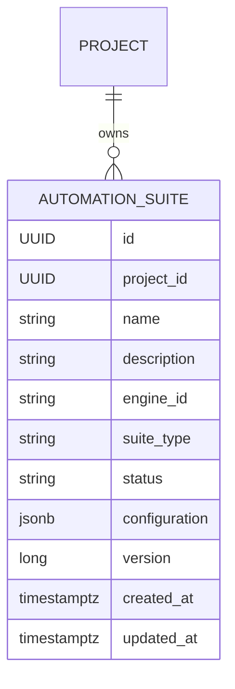

# AS-015: Automation Suite Management Software Requirements Specification

## 1. Overview

AS-015 defines Project-scoped management of platform-owned automation suites. It specifies the
domain, REST contract, persistence design, validation, errors, concurrency behavior, and test
expectations required before implementation.

This specification implements the terminology and boundaries accepted in
[ADR-005](../adr/ADR-005-platform-domain-naming-and-feature-first-architecture.md) and retains the
engine separation established by ADR-001.

## 2. Problem Statement

Automation Studio does not yet expose a supported Project CRUD resource for defining reusable
automation groupings. The existing `TestSuite` entity and `test_suite` table are an incomplete
earlier version of the platform-managed suite concept. They already own suite UUIDs and are
referenced by executions, but they do not implement the approved Automation Suite API, JSONB
configuration, stable engine identifier, suite taxonomy, or optimistic concurrency contract.

## 3. Business Objective

Allow a client to create, retrieve, list, update, archive, reactivate, and delete automation suite
definitions within an existing Project while keeping the platform core independent of automation
engine implementations.

## 4. User Story

As an Automation Studio user, I want to manage automation suites within a Project so that I can
organize engine-independent automation metadata and preserve the configuration needed by a future
engine integration.

## 5. Scope

AS-015 includes:

- Project-owned `AutomationSuite` CRUD behavior.
- Stable string `engineId` storage.
- Platform-owned suite type and lifecycle status.
- Opaque JSONB configuration persistence.
- Project-scoped name uniqueness.
- Optimistic concurrency for suite updates.
- Preservation of existing suite UUIDs and historical Execution relationships.
- Backward-compatible evolution of the existing logical suite aggregate.
- API, service, repository, mapping, validation, error handling, and tests delivered through the
  implementation phases in section 20.

## 6. Out of Scope

- Automation Test Cases or case membership.
- Execution creation or runner behavior.
- Scheduling, queues, leases, or cancellation.
- Engine discovery, installation, loading, or health checks.
- Engine-specific configuration schema validation.
- Playwright, Selenium, Karate, REST Assured, Appium, or other engine adapters.
- AI-assisted generation or analysis.
- Pagination and filtering.
- Changes to existing Project behavior.
- Immediate physical renaming of `test_suite`, `execution.test_suite_id`, or their constraints and
  indexes.
- Unapproved inference or destructive conversion of legacy suite data.

## 7. Domain Model

Each Automation Suite belongs to exactly one existing Project. A Project may own zero or more
Automation Suites. The relationship is unidirectional from `AutomationSuite` to `Project` unless a
later implementation requirement proves a reverse collection necessary.



`AutomationSuite` is a platform resource. An engine adapter may translate it into an engine-native
model, but the core model does not expose native engine concepts. During the transition, this
logical entity remains stored in the existing physical `test_suite` table, and existing
executions continue to reference it through `execution.test_suite_id`.

## 8. Entity Fields

| Field | Type | Required | Persistence | Notes |
|---|---|---:|---|---|
| `id` | UUID | Yes | `id UUID` | Application-generated primary key. |
| `projectId` | UUID | Yes | `project_id UUID` | References the existing singular `project` table. |
| `name` | String | Yes | Existing `name VARCHAR(150)` | New API limit is 100; the column is not narrowed until deployed data is approved. |
| `description` | String | No | Existing `description TEXT` | New API limit is 1000; the column is not narrowed until deployed data is approved. |
| `engineId` | String | Yes | Transitional field to be added | Mapping from legacy `engine_type` requires approval. |
| `suiteType` | `SuiteType` | Yes | `suite_type VARCHAR(30)` | Platform taxonomy. |
| `status` | `AutomationSuiteStatus` | Yes | `status VARCHAR(30)` | Defaults to `ACTIVE`. |
| `configuration` | JSON object | Yes | `configuration JSONB` | Defaults to `{}` when absent. |
| `version` | Long | Yes | `version BIGINT` | Optimistic-lock value, initially `0`. |
| `createdAt` | OffsetDateTime | Yes | `created_at TIMESTAMPTZ` | Created once using existing audit conventions. |
| `updatedAt` | OffsetDateTime | Yes | `updated_at TIMESTAMPTZ` | Updated using existing audit conventions. |

Initial `SuiteType` values are `API`, `UI`, `MOBILE`, `PERFORMANCE`, `SECURITY`, and `DATABASE`.
Adding a value changes platform taxonomy and requires a platform release. A new engine identifier
does not require a new suite type when an existing value applies.

Initial `AutomationSuiteStatus` values are `ACTIVE` and `ARCHIVED`.

## 9. Business Rules

1. A suite cannot exist without an existing Project.
2. A suite name is unique within its Project after normalization.
3. Name normalization removes leading and trailing whitespace. Internal whitespace and letter case
   are preserved and significant. Therefore `Smoke Suite` and `smoke suite` are distinct, while
   ` Smoke Suite ` conflicts with `Smoke Suite`. This matches the current Project service's trim
   and case-sensitive comparison behavior and is deterministic across application and database.
4. The same normalized name may exist in different Projects.
5. `engineId` is trimmed but remains case-sensitive because it is an opaque registered identifier.
6. Creation sets status to `ACTIVE`; clients cannot override the creation default.
7. Update may change name, description, engineId, suiteType, status, and configuration, but not id,
   owning Project, creation timestamp, or server-controlled version.
8. Status updates may archive and reactivate a suite.
9. A suite with no Execution references may be physically deleted. A suite referenced by an
   Execution cannot be physically deleted because `execution.test_suite_id` uses
   `ON DELETE RESTRICT`; the API returns 409 or requires the suite to be archived while references
   remain.
10. The core stores configuration without interpreting engine-specific keys.
11. Existing suite UUIDs must not change during migration.
12. No second writable suite table or aggregate is introduced.

## 10. REST API Contract

The repository's established API base is `/api/v1`; therefore the approved resource shapes are
versioned as follows:

| Method | Path | Success | Purpose |
|---|---|---:|---|
| POST | `/api/v1/projects/{projectId}/automation-suites` | 201 | Create under a Project. |
| GET | `/api/v1/projects/{projectId}/automation-suites` | 200 | List suites for one Project. |
| GET | `/api/v1/automation-suites/{suiteId}` | 200 | Retrieve a suite by id. |
| PUT | `/api/v1/automation-suites/{suiteId}` | 200 | Replace mutable suite metadata. |
| DELETE | `/api/v1/automation-suites/{suiteId}` | 204/409 | Delete an unreferenced suite; reject deletion while Execution references exist. |

The list endpoint returns only suites owned by `projectId`, ordered by normalized name ascending
and then id ascending. The id tie-breaker makes ordering deterministic. AS-015 does not add
pagination because current Project listing is unpaged. Pagination and filters may be introduced in
a later version when collection size or repository-wide conventions justify them.

GET, PUT, and DELETE by suite id are not nested because the approved canonical suite resource is
globally addressable. Authorization must still derive and check Project ownership.

## 11. Request and Response Examples

### Create request

```json
{
  "name": "Checkout smoke",
  "description": "Critical checkout scenarios",
  "engineId": "playwright-java",
  "suiteType": "UI",
  "configuration": {
    "browser": "chromium",
    "headless": true
  }
}
```

### Create response

```json
{
  "id": "9d25cf28-4ba8-4e26-997d-7f1d06efb210",
  "projectId": "af13526c-63e5-4ab5-b565-a01f39962a78",
  "name": "Checkout smoke",
  "description": "Critical checkout scenarios",
  "engineId": "playwright-java",
  "suiteType": "UI",
  "status": "ACTIVE",
  "configuration": {
    "browser": "chromium",
    "headless": true
  },
  "version": 0,
  "createdAt": "2026-07-17T14:30:00Z",
  "updatedAt": "2026-07-17T14:30:00Z"
}
```

### Update request

```json
{
  "name": "Checkout regression",
  "description": "Checkout regression coverage",
  "engineId": "playwright-java",
  "suiteType": "UI",
  "status": "ARCHIVED",
  "configuration": {
    "browser": "chromium",
    "headless": true
  },
  "version": 0
}
```

The update version is the version last read by the client. A successful update increments the
version returned in the response.

### Empty configuration

Omitting `configuration` on create is equivalent to:

```json
{
  "configuration": {}
}
```

Arrays, strings, numbers, booleans, and JSON `null` are invalid top-level configuration values.

## 12. Validation Rules

| Input | Rule |
|---|---|
| `projectId` | Must be a valid UUID identifying an existing Project. |
| `suiteId` | Must be a valid UUID for routes requiring a suite. |
| `name` | Required after trimming; maximum 100 characters after trimming. |
| `description` | Optional; maximum 1000 characters when supplied. |
| `engineId` | Required after trimming; maximum 100 characters after trimming. |
| `suiteType` | Required and one of the supported platform values. |
| `status` | Omitted on create and defaults to `ACTIVE`; required on update. |
| `configuration` | Optional JSON object; malformed JSON or a non-object value is rejected. |
| `version` | Required and non-negative on update; not accepted on create. |

Unknown enum strings are invalid. Configuration field names and values are preserved without
engine-specific validation in AS-015.

## 13. Error Behaviour

Errors use the existing `ApiErrorResponse` shape: `timestamp`, numeric `status`, HTTP reason
`error`, safe `message`, and request `path`.

| Condition | Status | Required behavior |
|---|---:|---|
| Invalid UUID, enum, field, or JSON body | 400 | Return a readable validation or malformed-body message. |
| Project does not exist | 404 | Identify the missing Project id. |
| Suite does not exist | 404 | Identify the missing suite id. |
| Duplicate normalized name in Project | 409 | Identify the name and Project without exposing internals. |
| Stale update version | 409 | Report that the suite was concurrently modified. |
| Suite is referenced by an Execution | 409 | Preserve execution history and require archiving instead of deletion. |
| Unexpected failure | 500 | Use the existing generic safe message and log server-side details. |

The existing generic `ResourceNotFoundException` and `DuplicateResourceException` are reusable.
Optimistic-lock translation must integrate with the global error model during implementation; no
new exception name is prescribed by this specification.

## 14. Database Design

AS-015 evolves the existing logical suite aggregate through a staged expand-and-contract
migration. It does not immediately create a separate `automation_suites` table.

### Initial physical compatibility boundary

The first migration phase retains:

- Existing suite UUIDs in `test_suite.id`.
- The physical `test_suite` table.
- `execution.test_suite_id` and its existing foreign key.
- `test_suite.project_id` and its foreign key to the singular `project` table.
- Existing names, descriptions, engine values, suite references, statuses, timestamps,
  constraints, and indexes until their compatibility has been assessed.

The migration adds the AS-015 fields needed for stable engine identity, platform suite type,
JSONB configuration, and optimistic locking in backward-compatible forms. New columns must be
nullable or have compatibility-safe defaults during expansion. New non-null and check constraints
become authoritative only after every existing row has been mapped and validated.

The initial migration must not:

- Rename or drop `test_suite`.
- Rename or repoint `execution.test_suite_id`.
- Create a second writable suite table.
- Change existing suite UUIDs.
- Drop legacy `engine_type` or `suite_reference` columns.
- Narrow `name VARCHAR(150)` to `VARCHAR(100)`.
- Narrow `description TEXT` to `VARCHAR(1000)`.
- Silently rewrite or truncate deployed values.

The API applies the new 100-character name and 1000-character description limits to newly created
or updated values. Physical narrowing is deferred until deployed data has been inventoried,
overlength values have approved treatment, and compatibility has been observed.

### Implementation gates

The following are blocking implementation gates, not assumptions to be resolved inside migration
SQL:

1. Inventory every supported deployed database for suite and execution row counts, maximum field
   lengths, status distribution, engine values, suite-reference formats, blank names, and
   trim-normalized name collisions.
2. Identify direct database, reporting, runner, or application consumers of `test_suite` and
   `execution.test_suite_id`.
3. Approve deterministic, lossless treatment for:
   - `engine_type` to `engineId`.
   - `suite_reference` to configuration JSON.
   - Each legacy row's `SuiteType`.
   - Legacy `INACTIVE` status in the supported lifecycle model.
   - Names longer than 100 characters.
   - Descriptions longer than 1000 characters.
   - Names that collide after trimming.
4. Verify the proposed backfill against a copy of populated legacy data before enforcing target
   constraints.

The repository does not provide enough evidence to define these mappings. The implementation must
not infer them from engine names or discard legacy values.

### Later physical contract migration

After the terminology cutover and compatibility observation period, a separate migration may
rename the table, `execution.test_suite_id`, constraints, and indexes. That migration requires a
verified consumer inventory and rollback plan. The repository currently follows singular table
naming; the eventual physical table name must be chosen consistently or explicitly supersede that
convention.

The existing `ON DELETE RESTRICT` relationship remains authoritative. Referenced suites are
archived or return 409 on deletion; they are not physically removed while historical executions
depend on them.

## 15. Concurrency Strategy

`AutomationSuite` uses JPA optimistic locking through a `@Version`-mapped `version` column,
consistent with the existing Execution entity. Update requests carry the last observed version.
Concurrent updates using a stale version return 409 rather than silently overwriting newer data.

The database unique constraint is authoritative for concurrent duplicate-name creation or rename.
The service may perform a pre-check for a clear message, but it must also translate a uniqueness
violation caused by a race into the same 409 contract.

Delete returns 204 only when the suite is unreferenced and physically removed. A referenced suite
returns 409 and remains available to historical executions. Delete races return 404 or 409
according to the state observed by the losing operation; they must not return a false success for
an update or deletion that was not persisted.

## 16. Security Considerations

- Authorization must verify access to the owning Project for every operation, including globally
  addressed suite ids. Authentication/authorization implementation is not added by AS-015 unless
  the repository has an established security mechanism by the implementation phase.
- Do not treat `engineId` or JSON keys as class names, scripts, paths, or executable input.
- Do not place credentials or secrets in `configuration`; future secret references require a
  separate scoped design.
- Apply request-size limits from platform configuration to prevent oversized JSON payloads.
- Error responses and logs must not expose configuration secrets, SQL, stack traces, or internal
  engine details.
- JSON serialization must not enable unsafe polymorphic type construction from request data.

## 17. Testing Strategy

| Layer | Required coverage |
|---|---|
| Service unit tests | Project existence, normalization, duplicate handling, mapping, lifecycle updates, deletion, and concurrency translation. |
| Mapper tests | Only non-trivial JSON, version, or ownership mappings not covered adequately elsewhere. |
| Controller/web tests | Routes, DTO validation, enum/JSON errors, response bodies, status codes, and global error shape. |
| Repository tests | Project isolation, deterministic ordering, unique constraint, lossless JSONB round-trip, optimistic locking, and referenced-suite delete restriction. |
| Migration tests | Upgrade from populated legacy `test_suite` and `execution` rows while preserving UUIDs, foreign keys, and legacy information. |
| Testcontainers integration tests | Full Spring Boot, Flyway, PostgreSQL, MockMvc CRUD, cross-Project isolation, malformed input, error responses, and historical Execution resolution. |

Tests use the shared PostgreSQL Testcontainers foundation introduced in AS-014. No in-memory
database substitutes PostgreSQL behavior for JSONB, constraints, or optimistic locking.

## 18. Acceptance Criteria

- [ ] Create a suite under an existing Project and return 201 with server-owned fields.
- [ ] Reject creation under a missing Project with 404.
- [ ] Reject a duplicate trim-normalized name in the same Project with 409.
- [ ] Permit the same normalized name in different Projects.
- [ ] Retrieve an existing suite by id and return 404 for a missing id.
- [ ] List only suites belonging to the specified Project in deterministic order.
- [ ] Update mutable suite metadata and persist the returned values.
- [ ] Archive and reactivate a suite through status updates.
- [ ] Physically delete an unreferenced suite and return 204.
- [ ] Return 409, or require archiving, when an Execution references the suite.
- [ ] Return 400 for invalid UUIDs, required fields, lengths, enums, versions, and malformed or
  non-object configuration JSON.
- [ ] Preserve engine-specific configuration through create, read, and update without introducing
  an engine dependency into the core model.
- [ ] Round-trip JSON configuration through PostgreSQL without information loss.
- [ ] Reject a stale optimistic-lock version with 409.
- [ ] Verify database uniqueness under concurrent or constraint-level tests.
- [ ] Preserve every existing suite UUID through the migration.
- [ ] Load existing executions after migration and resolve each execution's suite relationship.
- [ ] Run migration tests from populated legacy suite and execution data, not only an empty schema.
- [ ] Keep `test_suite` and `execution.test_suite_id` during the initial compatibility phases.
- [ ] Do not create a second writable suite table or aggregate.
- [ ] Leave existing Project behavior unchanged.

## 19. Definition of Done

- ADR-005 and this SRS are reviewed and accepted.
- Deployed-data and consumer inventory is completed before schema expansion becomes authoritative.
- All legacy mapping decisions are reviewed and approved before data backfill or constraint
  contraction.
- The Flyway migration applies cleanly to an empty database and an existing supported schema.
- Migration tests prove existing suite UUIDs and Execution relationships are preserved.
- Entity mappings match Flyway exactly and Hibernate validation succeeds.
- API implementation follows the feature-first package and versioned routes in this specification.
- Validation, errors, optimistic locking, JSONB, uniqueness, and Project isolation are covered.
- JSON configuration round-trips without loss, and stale optimistic-lock updates return 409.
- Unit, web-layer, and PostgreSQL Testcontainers suites pass.
- Documentation and API examples match implemented behavior.
- Review checklist passes with no production dependency on an automation engine.
- No unrelated Project code or behavior is modified.

## 20. Implementation Phases

### Phase 0: Deployed-data and consumer inventory

This phase is an implementation gate.

- Inventory supported deployed databases and populated legacy rows.
- Identify physical-table, Java, reporting, runner, and operational consumers.
- Record length, status, engine, reference, and normalized-name collision findings.
- Approve rollback and compatibility requirements before migration design is finalized.

### Phase 1: Backward-compatible schema expansion

- Add AS-015 columns to `test_suite` in compatibility-safe forms.
- Preserve suite UUIDs, Project ownership, `test_suite`, and `execution.test_suite_id`.
- Retain legacy columns and avoid narrowing existing types.
- Add migration coverage for both empty and populated legacy schemas.

### Phase 2: Legacy data mapping and validation

This phase is an implementation gate. Backfill cannot proceed until every mapping is approved.

- Apply approved engine identifier, configuration, suite type, status, length, and name-collision
  rules.
- Preserve legacy information without silent truncation or deletion.
- Validate every migrated suite and its historical Execution relationship.
- Add authoritative non-null and check constraints only after validation succeeds.

### Phase 3: AutomationSuite Java/API terminology cutover

- Introduce the feature-first package under `com.automationstudio.api.automation.suite`.
- Map `AutomationSuite` to the transitional `test_suite` physical table.
- Move the Execution Java relationship to AutomationSuite terminology while retaining the physical
  `test_suite_id` column.
- Do not keep two independently writable JPA suite entities over the same table.
- Implement the versioned REST contract, validation, generic error integration, and tests.

### Phase 4: Compatibility observation

- Verify existing and new suites resolve through the AutomationSuite model.
- Verify historical executions continue to load.
- Verify JSON configuration round-trips without loss.
- Confirm no legacy writer or physical-name consumer remains.
- Retain legacy columns and names for the approved rollback window.

### Phase 5: Later physical database rename and cleanup

- Gate this phase on verified deployed-data and consumer compatibility.
- Decide the final physical table name consistently with repository naming conventions.
- Rename the table, foreign-key column, constraints, and indexes in coordinated migrations.
- Remove legacy columns only after their data is preserved and rollback compatibility is closed.
- Revalidate Flyway, Hibernate mappings, executions, and operational consumers after each contract
  step.
