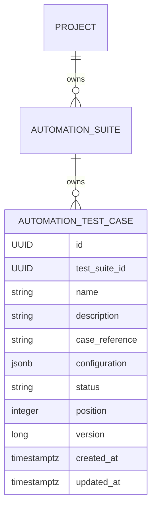

# AS-016: Automation Test Case Management Software Requirements Specification

## 1. Status and Purpose

**Status:** Implemented; documentation reconciled with the delivered contract on 2026-07-19.

AS-016 delivers Project- and Automation-Suite-scoped management of engine-native automation test
cases. An Automation Test Case identifies one native test inside the native suite or container
identified by its owning Automation Suite.

The goals are to provide independently versioned case CRUD, engine-neutral reference storage,
explicit lifecycle management, deterministic ordering, safe concurrent reordering, and deletion
rules that protect suite contents and future execution history.

This document is the as-built contract for AS-016A through AS-016F. The implementation follows
the durable decisions in
[ADR-006](../adr/ADR-006-automation-test-case-ownership-and-lifecycle.md) and preserves the string
engine-identity strategy and transitional persistence boundary documented by ADR-005 and AS-015.

## 2. Implementation Baseline and Outcome

The AS-016 branch starts from merge commit `cde007b`, where AS-015 is complete and its full Maven
suite has 116 passing tests. The current baseline provides:

- Spring Boot modular-monolith control plane using layer-first packages.
- PostgreSQL and Flyway migrations through V7.
- `AutomationSuite` mapped to transitional table `test_suite`.
- Project-scoped Automation Suite REST endpoints, pagination, sorting, and status filtering.
- Optional string `AutomationSuite.engineId`; no engine enum or Engine Registry.
- Required transitional suite fields `engineType` and `suiteReference`.
- JPA optimistic versioning on Automation Suite and Execution.
- `Execution` ownership of a suite through transitional `execution.test_suite_id` with
  `ON DELETE RESTRICT`.
- `ApiErrorResponse` for standard API errors.
- PostgreSQL Testcontainers foundations and full REST integration tests.

AS-016 preserves that baseline and adds the test-case migration, domain, repository, service,
mapper, DTOs, nested REST API, suite safeguards, and PostgreSQL verification. Execution remains
unchanged and still has no relationship to an individual test case. Production code follows the
repository's existing layer-first package structure.

## 3. Scope

AS-016 includes:

- Independently persisted and versioned `AutomationTestCase` aggregates.
- Mandatory ownership by an existing Automation Suite.
- Project, suite, and case isolation for every operation.
- Required engine-native `caseReference` storage.
- Optional JSONB configuration storage without engine interpretation.
- Suite-scoped name and case-reference uniqueness.
- ACTIVE, INACTIVE, and ARCHIVED lifecycle states.
- Explicit nonnegative positions and deterministic listing.
- Concurrency-safe append, delete, and atomic complete-set reorder behavior.
- Physical case deletion while no Execution references cases.
- Application-level suite deletion protection when any case exists.
- Protection of suite engine-defining fields while any case exists.
- Flyway, domain, repository, service, mapping, REST, MVC, and PostgreSQL integration coverage.

## 4. Explicit Out of Scope

- Structured or platform-authored test definitions.
- Definition-type enums and definition schema versions.
- Visual or programmatic step builders.
- AI generation, analysis, or modification of tests.
- Engine adapters, test translation, plugin loading, and runner behavior.
- Engine Registry implementation or validation.
- Engine-specific case-reference or configuration-schema validation.
- Case-level Execution creation, selection, results, or history.
- Scheduling, queues, leases, cancellation, and execution orchestration.
- Authentication and authorization.
- Frontend behavior.
- Moving a case between suites.
- Bulk import, export, cloning, or cross-suite copying.
- Physical renaming of `test_suite`, `test_suite_id`, or `execution.test_suite_id`.
- Stable custom pagination envelopes.
- Shared optimistic-lock API translation.
- Translation of suite deletion conflicts caused by existing Execution records.

## 5. Domain Model

`AutomationTestCase` is independently persisted and independently versioned. It has mandatory
ownership by one `AutomationSuite`, but the suite does not contain a mutable JPA collection of
cases.



Implemented Java model:

```text
AutomationTestCase
- id: UUID
- automationSuite: AutomationSuite
- name: String
- description: optional String
- caseReference: required String
- configuration: optional JSON object
- status: AutomationTestCaseStatus
- position: nonnegative Integer
- version: server-controlled long
- createdAt: OffsetDateTime
- updatedAt: OffsetDateTime
```

`AutomationTestCaseStatus` values are `ACTIVE`, `INACTIVE`, and `ARCHIVED`. It is separate from
`AutomationSuiteStatus` so that the lifecycles may evolve independently.

## 6. Ownership and Isolation Rules

Every operation verifies the complete hierarchy:

```text
Project -> AutomationSuite -> AutomationTestCase
```

Rules:

1. A case cannot exist without an Automation Suite.
2. The suite must belong to the Project identified by the route.
3. Get, PUT, PATCH, and DELETE must find the case within the identified suite.
4. Listing returns only cases owned by the identified suite.
5. A suite outside the Project returns 404.
6. A case outside the suite returns 404, even if its UUID exists elsewhere.
7. A case cannot be moved to another suite through update.
8. `AutomationSuite` does not expose a mutable JPA case collection.

These rules provide resource isolation without disclosing cross-Project or cross-suite existence.
Authorization is deferred, but it must later apply the same ownership chain.

## 7. Engine Inheritance and Reference Semantics

A case inherits the engine identity of its owning suite. It stores neither `engineId` nor
`engineType`, and AS-016 introduces no engine enum.

The references have different scopes:

- `AutomationSuite.suiteReference` identifies an engine-native suite, container, file, project,
  feature collection, or equivalent grouping.
- `AutomationTestCase.caseReference` identifies one engine-native test within that suite or
  container.

For example, a suite reference may identify `tests/checkout.spec.ts`, while a case reference
identifies `successful checkout` inside that file. Both are opaque, case-sensitive strings. The
platform does not verify their native syntax or existence during AS-016.

## 8. Field Definitions

| Field | Type | Required | Ownership and behavior |
|---|---|---:|---|
| `id` | UUID | Yes | Server-generated primary key. |
| `automationSuite` | AutomationSuite | Yes | Server-controlled from the nested route. |
| `name` | String | Yes | Trimmed, maximum 150, suite-scoped unique. |
| `description` | String | No | Optional text. |
| `caseReference` | String | Yes | Trimmed, maximum 300, suite-scoped unique. |
| `configuration` | JSON object | No | Nullable JSONB, stored without engine interpretation. |
| `status` | AutomationTestCaseStatus | Yes | Create defaults to `ACTIVE`. |
| `position` | Integer | Yes | Server-controlled, nonnegative, unique within the suite. |
| `version` | long | Yes | Server-controlled JPA `@Version`, initially zero. |
| `createdAt` | OffsetDateTime | Yes | Server-controlled creation timestamp. |
| `updatedAt` | OffsetDateTime | Yes | Server-controlled update timestamp. |

PUT may change `name`, `description`, `caseReference`, and `configuration`. It cannot change
status, position, ownership, version, identity, or timestamps.

Create cannot control `id`, ownership, position, version, or timestamps. PUT cannot control
identity, ownership, status, position, version, or timestamps; unknown raw server fields are
ignored at the DTO boundary.

## 9. Validation and Normalization

| Input | Rule |
|---|---|
| `projectId` | Valid UUID identifying an existing Project. |
| `suiteId` | Valid UUID identifying a suite owned by the Project. |
| `caseId` | Valid UUID identifying a case owned by the suite. |
| `name` | Required, trimmed nonblank, maximum 150. |
| `description` | Optional text. |
| `caseReference` | Required, trimmed nonblank, maximum 300. |
| `configuration` | Optional JSON object; other top-level JSON types are invalid. |
| `status` on create | Optional; defaults to `ACTIVE`. |
| `status` on PATCH | Required supported value. |
| `caseIds` on reorder | Required collection of non-null UUID elements. |
| `position` | Server-controlled and nonnegative. |
| `version` | Server-controlled and nonnegative. |

Leading and trailing whitespace is removed from names and case references before persistence.
Internal whitespace and letter case are preserved and significant. Names and references are
case-sensitive and unique within one suite. The same normalized values may exist in different
suites.

Database uniqueness constraints are authoritative for concurrent writes. Unknown enum values,
invalid UUIDs, malformed JSON, and non-object configuration values return 400.

## 10. Status Lifecycle

The engine-neutral lifecycle is:

- `ACTIVE`: available for future execution selection.
- `INACTIVE`: temporarily unavailable.
- `ARCHIVED`: retained but no longer active.

Create may omit status and defaults to `ACTIVE`. PUT cannot change status. The explicit status
PATCH accepts one required status and supports all three values.

Archival is not deletion. Archived cases remain owned by their suite, remain subject to uniqueness
and ordering, block suite deletion, and prevent changes to suite engine-defining fields.

AS-016 does not define execution eligibility or automatic status propagation between suites and
cases.

## 11. Suite Engine-Field Protection

If a suite contains one or more cases in any status, suite PUT rejects changes to:

- `engineId`
- Transitional `engineType`
- Transitional `suiteReference`

The update runs in one transaction and follows the shared suite-lock protocol:

1. Validate or find the Project.
2. Find and pessimistically lock the suite using both `projectId` and `suiteId`.
3. Compare `engineId`, `engineType`, and `suiteReference` using null-safe comparison.
4. If any protected value changes, check whether any case exists.
5. Return 409 before modifying the suite when a case exists in any status, including ARCHIVED.
6. Otherwise apply the update and commit.

Supplying the same persisted protected values is not a change and must not be rejected. Other
AS-015 mutable fields remain editable, and suite status continues to use its existing PATCH
endpoint. Conflict rejection rolls back the transaction completely.

The smallest implementation extends the test-case repository with an existence query and uses it
from `AutomationSuiteServiceImpl` only when an engine-defining value differs. No mutable case
collection is added to the suite.

Tests cover each protected field, unchanged protected values, allowed metadata updates, archived
cases, no-case suites, ownership isolation, and absence of partial updates after a conflict.
PostgreSQL service integration verifies that case creation racing with a protected suite update
serializes on the suite lock and cannot produce a case attached to a newly changed engine
definition.

## 12. Suite and Test-Case Deletion Behavior

### Suite deletion

Any test case prevents physical suite deletion, including an ARCHIVED case. The application checks
for cases and returns 409 Conflict. Archiving cases does not permit deletion. Every case must be
physically deleted before its suite can be deleted.

Suite deletion starts one transaction, validates the Project, and pessimistically locks the suite
using both `projectId` and `suiteId`. It then checks case existence, returns 409 without deleting
when any case exists, or deletes the suite and commits atomically when none exists. Case creation
locks the same suite row before insertion, so a case cannot be inserted between the guard and
suite deletion.

The database additionally uses `ON DELETE RESTRICT` from `automation_test_case.test_suite_id` to
`test_suite.id`.

AS-016 translates only the suite-with-cases conflict. It does not claim to translate conflicts
caused by existing `execution.test_suite_id` references; that AS-015 deferred item remains future
work. The existing database foreign key continues to protect those Execution references.

### Test-case deletion

AS-016 physically deletes a test case and returns 204 because no Execution currently references an
individual case. Missing and cross-scope cases return 404.

Future execution-to-case relationships must use `ON DELETE RESTRICT`. A referenced case must then
be archived instead of physically deleted, with deliberate conflict translation added by that
future work.

## 13. Ordering and Concurrency Behavior

### Positions and listing

Each case has a nonnegative integer position unique within its suite. New cases append at
`max(position) + 1`, or position zero for an empty suite. Deletion may leave gaps. Ordinary POST
and PUT requests cannot choose a position.

Default list ordering is `position ASC`, with `id ASC` as a defensive tie-breaker. Clients may use
Spring sorting parameters when another view is required.

### Shared suite serialization

All operations that can change suite/case ownership integrity acquire a pessimistic write lock on
the project-owned suite before checking case existence or changing data. The common lock order is:

1. Validate or find the Project.
2. Find and pessimistically lock the suite using both `projectId` and `suiteId`.
3. Perform case-existence or membership checks.
4. Lock test-case rows when the operation requires them.
5. Apply changes.
6. Commit.

The suite lock query is Project-scoped. A suite UUID owned by another Project returns 404 without
disclosing its existence. Case create, test-case delete, suite delete, protected suite update, and
reorder use this common ordering. The lock serializes integrity changes for the same suite while
allowing different suites to change concurrently.

After locking the suite, create queries the maximum current position and appends the new case. The
suite lock prevents concurrent creates or reorder operations from calculating the same next
position. Database uniqueness remains authoritative.

Delete locks the suite before removing a case so that it cannot race with complete-set reorder
validation.

### Atomic reorder

`PUT /order` supplies the complete current case-ID set exactly once. In one transaction, the
service:

1. Verifies and locks the owning suite.
2. Loads and pessimistically locks all current cases for the suite.
3. Rejects missing, duplicate, extra, cross-suite, or cross-Project identifiers.
4. Assigns positions zero through `n - 1` in request order.
5. Flushes changes and commits only after database constraints pass.

The `(test_suite_id, position)` unique constraint is `DEFERRABLE INITIALLY DEFERRED`, so position
swaps do not fail at an intermediate update. Validation or constraint failure rolls back the
complete transaction; partial reorder is forbidden.

Service and PostgreSQL integration tests cover concurrent creates, suite-lock contention with
protected suite update and suite deletion, swaps, complete reversal, invalid ID sets, and rollback.
Exact PostgreSQL PID lock-wait behavior is verified at the service integration layer. HTTP
integration verifies concurrent creates and final database invariants without claiming exact
HTTP-boundary lock observation. A concurrent HTTP reorder scenario is deferred.

## 14. REST API

Base path:

```text
/api/v1/projects/{projectId}/automation-suites/{suiteId}/test-cases
```

| Method | Path | Success | Purpose |
|---|---|---:|---|
| POST | Base path | 201 | Create and append a case. |
| GET | Base path | 200 | List cases for the suite. |
| GET | `/{caseId}` | 200 | Retrieve one case. |
| PUT | `/{caseId}` | 200 | Replace mutable case metadata. |
| PATCH | `/{caseId}/status` | 200 | Change lifecycle status. |
| DELETE | `/{caseId}` | 204 | Physically delete a case. |
| PUT | `/order` | 200 | Atomically reorder all suite cases. |

List accepts Spring pagination and sorting parameters and an optional `status` filter. With no
client sort, it uses position ascending and ID ascending. Explicit caller sorting replaces those
defaults. The delivered response is Spring's directly serialized root-level `Page` JSON; this is
a known stability risk, and a stable custom envelope remains deferred.

The reorder response returns the complete ordered case list rather than a partial page.

The exact successful reorder response contract is:

- HTTP 200 OK.
- `Content-Type: application/json`.
- Body type: JSON array of `AutomationTestCaseResponse`.
- The array contains the complete current suite membership.
- Array order exactly matches committed position order.
- The response is not paginated.
- No partial response may be returned.

If the suite currently contains no cases, `{"caseIds":[]}` is valid and returns HTTP 200 with
`[]`. If the suite contains one or more cases, an empty `caseIds` list is invalid and returns 400
using `ApiErrorResponse`; no ordering changes occur.

## 15. Request and Response Examples

### Create request

```json
{
  "name": "Successful checkout",
  "description": "Completes checkout with a valid cart",
  "caseReference": "successful checkout",
  "configuration": {
    "retries": 1
  },
  "status": "ACTIVE"
}
```

`description`, `configuration`, and `status` are optional. Omitted status defaults to `ACTIVE`.

### Create or read response

```json
{
  "id": "7bbf0fc2-82e9-4a68-b56b-e89b68ec0055",
  "automationSuiteId": "9d25cf28-4ba8-4e26-997d-7f1d06efb210",
  "name": "Successful checkout",
  "description": "Completes checkout with a valid cart",
  "caseReference": "successful checkout",
  "configuration": {
    "retries": 1
  },
  "status": "ACTIVE",
  "position": 0,
  "version": 0,
  "createdAt": "2026-07-19T12:00:00Z",
  "updatedAt": "2026-07-19T12:00:00Z"
}
```

### PUT request

```json
{
  "name": "Successful checkout with card",
  "description": "Completes card checkout with a valid cart",
  "caseReference": "successful card checkout",
  "configuration": {
    "retries": 2
  }
}
```

### Status PATCH request

```json
{
  "status": "ARCHIVED"
}
```

### Reorder request

```json
{
  "caseIds": [
    "7bbf0fc2-82e9-4a68-b56b-e89b68ec0055",
    "16aee149-f773-442c-bde7-840137bcdbe8",
    "222ea8ea-b69a-42fd-8f2e-f798a150cdb9"
  ]
}
```

The list must contain every current case in the suite exactly once.

### Reorder response

```json
[
  {
    "id": "case-id-1",
    "automationSuiteId": "suite-id",
    "name": "First case",
    "description": null,
    "caseReference": "first case",
    "configuration": null,
    "status": "ACTIVE",
    "position": 0,
    "version": 1,
    "createdAt": "2026-07-19T12:00:00Z",
    "updatedAt": "2026-07-19T12:10:00Z"
  },
  {
    "id": "case-id-2",
    "automationSuiteId": "suite-id",
    "name": "Second case",
    "description": null,
    "caseReference": "second case",
    "configuration": null,
    "status": "ACTIVE",
    "position": 1,
    "version": 1,
    "createdAt": "2026-07-19T12:01:00Z",
    "updatedAt": "2026-07-19T12:10:00Z"
  }
]
```

For an empty suite, the valid request and response are:

```json
{
  "caseIds": []
}
```

```json
[]
```

## 16. Error Behavior

Errors use the existing `ApiErrorResponse` shape: timestamp, numeric status, HTTP reason, safe
message, and request path.

| Condition | Status | Required behavior |
|---|---:|---|
| Invalid UUID, enum, field, JSON body, or reorder set | 400 | Return a readable validation or malformed-input response. |
| Missing or cross-scope Project, suite, or case | 404 | Do not disclose ownership outside the route. |
| Duplicate name or case reference within a suite | 409 | Identify the conflicting field without exposing internals. |
| Suite deletion while any case exists | 409 | Preserve all cases, including archived cases. |
| Protected suite engine-field change while any case exists | 409 | Preserve suite and case state. |
| Unexpected failure | 500 | Return a generic safe response and log details server-side. |

JPA `@Version` is an internal safeguard. AS-016 does not promise 409 for optimistic-lock failures.
Shared optimistic-lock translation remains deferred unless separately approved.

AS-016 also does not translate existing Execution-referenced suite deletion conflicts. That
behavior remains deferred from AS-015.

## 17. Database Design

AS-016 creates the singular `automation_test_case` table:

```sql
CREATE TABLE automation_test_case (
    id UUID PRIMARY KEY,
    test_suite_id UUID NOT NULL,
    name VARCHAR(150) NOT NULL,
    description TEXT,
    case_reference VARCHAR(300) NOT NULL,
    configuration JSONB,
    status VARCHAR(30) NOT NULL DEFAULT 'ACTIVE',
    position INTEGER NOT NULL,
    version BIGINT NOT NULL DEFAULT 0,
    created_at TIMESTAMP WITH TIME ZONE NOT NULL DEFAULT CURRENT_TIMESTAMP,
    updated_at TIMESTAMP WITH TIME ZONE NOT NULL DEFAULT CURRENT_TIMESTAMP,

    CONSTRAINT fk_automation_test_case_test_suite
        FOREIGN KEY (test_suite_id)
        REFERENCES test_suite (id)
        ON DELETE RESTRICT,

    CONSTRAINT uk_automation_test_case_suite_name
        UNIQUE (test_suite_id, name),

    CONSTRAINT uk_automation_test_case_suite_reference
        UNIQUE (test_suite_id, case_reference),

    CONSTRAINT uk_automation_test_case_suite_position
        UNIQUE (test_suite_id, position)
        DEFERRABLE INITIALLY DEFERRED,

    CONSTRAINT chk_automation_test_case_configuration
        CHECK (
            configuration IS NULL
            OR jsonb_typeof(configuration) = 'object'
        ),

    CONSTRAINT chk_automation_test_case_status
        CHECK (status IN ('ACTIVE', 'INACTIVE', 'ARCHIVED')),

    CONSTRAINT chk_automation_test_case_position
        CHECK (position >= 0),

    CONSTRAINT chk_automation_test_case_version
        CHECK (version >= 0)
);
```

V8 adds the one justified non-unique index used for suite/status filtering:

```sql
CREATE INDEX idx_automation_test_case_suite_status
    ON automation_test_case (test_suite_id, status);
```

No separate ownership or position index is added. The suite-leading unique constraints already
provide indexes for ownership/name, ownership/reference, and ownership/position access, so the
proposed duplicates were omitted.

The physical `test_suite_id` name is transitional. Java and API contracts use
`AutomationSuite` and `automationSuiteId`.

## 18. Migration Compatibility

The AS-016 migration is additive and requires no case-data backfill. It must:

- Preserve every existing suite and Execution row.
- Leave `test_suite` and `execution.test_suite_id` unchanged.
- Reference existing `test_suite(id)` with `ON DELETE RESTRICT`.
- Add no engine enum, Engine Registry, or engine-specific schema.
- Apply to both an empty database and an AS-015 database populated with suites and executions.
- Permit a later coordinated physical rename of both test-case and Execution suite foreign keys.

Migration tests must verify the exact schema, legacy data preservation, suite ownership,
uniqueness, JSON object validation, lifecycle values, nonnegative positions and versions,
deferrable position swaps, and restrictive suite deletion.

## 19. Execution Compatibility

AS-016 does not modify `Execution` and does not add an Execution-to-TestCase relationship.
Executions continue to select a suite through `execution.test_suite_id`.

Future case execution must define restrictive case relationships and immutable snapshots of:

- Case identity and name.
- Case reference and configuration.
- Case position.
- Suite identity and suite reference.
- Inherited engine identity and compatible engine version.
- Relevant source revision and non-secret runtime configuration.

Future foreign keys must use `ON DELETE RESTRICT`. Once execution history references a case,
physical deletion must be rejected and archival becomes the retention path. Historical results
must not depend solely on mutable current suite or case rows.

## 20. Delivered Verification

| Layer | Delivered coverage |
|---|---|
| Service unit tests | Ownership, normalization, uniqueness, status, append position, deletion, reorder validation, suite deletion guard, and engine-field guard. |
| Mapper tests | Real generated MapStruct mappings, ignored server fields, ownership mapping, and defensive configuration copying. |
| Controller MVC tests | Nested routes, DTO validation, pagination, sorting, status filtering, reorder, status changes, HTTP codes, and error shape. |
| Repository integration tests | Hierarchical scoping, uniqueness, JSONB, optimistic versioning, locking queries, deterministic order, and restrictive deletion. |
| Migration integration tests | Exact schema, existing AS-015 data preservation, check constraints, foreign keys, and deferrable uniqueness. |
| Suite-service regression tests | Existing AS-015 behavior plus case-related deletion and protected-engine-field guards. |
| Exception-handler tests | Stable 400 and 409 mappings with the shared safe `ApiErrorResponse`. |
| Concurrency integration tests | Deterministic PostgreSQL PID lock contention, concurrent creates, case creation versus protected suite update or suite deletion, swaps, rollback, and final invariants. |
| REST integration tests | Full Spring Boot, Flyway, MockMvc, and PostgreSQL CRUD, isolation, conflicts, ordering, configuration, exact reorder responses, validation, and concurrent HTTP creates. |

PostgreSQL Testcontainers is required for persistence, migration, locking, constraint, and full
REST integration tests. In-memory database behavior is not an acceptable substitute. The AS-016F
HTTP-to-PostgreSQL integration class contains 17 tests. The last known complete Maven result is
272 tests passed with no failures, errors, or skips; these counts record a verification run and are
not part of the permanent API contract.

MVC and full PostgreSQL REST integration tests verify the reorder JSON-array response type,
committed response order, valid empty-suite reorder, rejected empty request for a nonempty suite,
and absence of partial responses after failure. PostgreSQL concurrency tests also verify that
case creation racing with protected suite update or suite deletion serializes safely and cannot
violate ownership or inherited-engine integrity.

Test cleanup deletes test cases before executions and suites, then projects and workspaces, in
foreign-key-safe order.

## 21. Acceptance Criteria

- [x] CRUD and status endpoints enforce the complete Project-to-Suite-to-Case scope and return the
  documented success statuses with server-owned identity, ownership, position, version, and audit
  fields isolated from requests.
- [x] Names and case references are trimmed, nonblank, length-bounded, case-sensitive, and unique
  within a suite while the same values remain valid in different suites.
- [x] Optional description and JSON-object configuration persist without engine interpretation;
  create status defaults to `ACTIVE`, and PATCH supports `ACTIVE`, `INACTIVE`, and `ARCHIVED`.
- [x] Cases inherit suite engine identity, distinguish `suiteReference` from `caseReference`, and
  introduce no case-level engine fields, engine enum, or Engine Registry.
- [x] Listing provides Spring pagination, caller sorting, optional status filtering, and default
  `position ASC, id ASC` ordering using the current root-level Spring Page representation.
- [x] Create appends at the locked suite maximum plus one, detects integer exhaustion, and permits
  deletion gaps.
- [x] PUT changes only mutable metadata; PATCH changes status; successful writes retain JPA
  versioning without claiming stable optimistic-lock API translation.
- [x] Reorder requires complete membership exactly once, rejects null, duplicate, missing, extra,
  foreign, and invalid IDs, supports an empty suite, assigns positions from zero, returns the raw
  committed array, and rolls back completely on failure.
- [x] PostgreSQL deferrable position uniqueness permits atomic swaps, and the Project-scoped
  suite-first lock protocol serializes create, delete, reorder, protected suite update, and suite
  deletion.
- [x] Cases are physically deleted while Execution has no case relationship; every case status
  blocks suite deletion and changes to `engineId`, `engineType`, or `suiteReference`.
- [x] Unchanged protected fields and non-engine suite metadata remain editable while cases exist.
- [x] Deterministic PostgreSQL contention tests prove safe create-versus-protected-update and
  create-versus-suite-delete outcomes without orphaning or engine reinterpretation.
- [x] V8 preserves transitional `test_suite` and `test_suite_id` names, existing suites and
  executions, and restrictive ownership while requiring no data backfill.
- [x] Standard safe errors, migration, repository, service, mapper, MVC, HTTP-to-PostgreSQL, suite
  regression, and concurrent HTTP create behavior are verified with PostgreSQL 16 Testcontainers.
- [x] Existing Execution-reference deletion and optimistic-lock translations remain explicitly
  deferred, along with structured definitions, runner, scheduling, AI, frontend, and security work.

## 22. AS-016B-G Implementation Phases

AS-016B through AS-016F are complete. The bullets below record the delivered layer sequence; G is
the documentation reconciliation and complete-branch review.

### AS-016B: Database migration and migration tests

- Create `automation_test_case` with the approved fields.
- Add ownership, name, reference, position, JSON, status, and version constraints.
- Make suite-position uniqueness deferrable and initially deferred.
- Add the minimal suite/status non-unique index while relying on suite-leading unique-constraint
  indexes for ownership, name, reference, and position access.
- Test the migration against empty and populated AS-015 schemas.
- Prove existing suite and Execution compatibility and restrictive suite deletion.

### AS-016C: Domain, repository, locking, and repository integration

- Add `AutomationTestCaseStatus` and independently versioned `AutomationTestCase`.
- Keep `AutomationSuite` free of a mutable case collection.
- Add Project/suite/case-scoped repository queries.
- Add suite-scoped name and case-reference existence queries.
- Add pessimistic suite and complete-case locking queries.
- Keep the suite lock query scoped by both Project and suite identifiers.
- Add maximum-position and case-existence queries.
- Verify JSONB, defensive copies, optimistic locking, isolation, constraints, and ordering with
  PostgreSQL integration tests.

### AS-016D: Services, ordering, and suite guards

- Implement create, get, list, update, status change, physical delete, and atomic reorder.
- Normalize names and case references.
- Serialize create, delete, and reorder through the suite lock.
- Apply the same Project-scoped suite-first lock order to protected suite update and suite deletion.
- Validate complete reorder membership and roll back failures.
- Add the Automation Suite deletion guard for cases in every status.
- Add the Automation Suite engine-field guard for `engineId`, `engineType`, and `suiteReference`.
- Add explicit application-level 409 translation for those two case-related suite conflicts.
- Preserve all other AS-015 behavior.
- Do not add shared optimistic-lock or existing Execution-reference deletion translation without
  separate approval.

### AS-016E: REST API, mapper, DTO validation, and MVC tests

- Add nested Project/suite/case routes.
- Add request, response, status, and reorder DTOs.
- Add real MapStruct mapping with server-controlled fields ignored.
- Add pagination, sorting, optional status filtering, and deterministic default order.
- Validate JSON objects, required fields, status, UUIDs, and reorder membership.
- Cover standard errors, isolation, suite conflicts, and response contracts with MVC tests.

### AS-016F: Full PostgreSQL Testcontainers REST integration

- Exercise the complete HTTP-to-PostgreSQL path.
- Cover CRUD, isolation, uniqueness, configuration, lifecycle, ordering, and physical deletion.
- Cover suite deletion and engine-field conflicts without partial mutations.
- Cover concurrent HTTP creates and verify final database identities and positions.
- Cover case creation racing with protected suite update and suite deletion.
- Verify exact reorder response type, committed ordering, empty-suite behavior, and no partial response.
- Verify cleanup order and run the complete Maven suite.

### AS-016G: Final documentation reconciliation and branch review

- Reconcile ADR-006 and this SRS with delivered behavior without rewriting decision history.
- Review the complete branch diff for scope, migration safety, naming, locking, and isolation.
- Record deferred behavior accurately.
- Run `git diff --check`, focused verification where needed, and the full Maven suite.
- Leave final changes unstaged unless separately instructed.

## 23. Risks and Deferred Decisions

- Shared optimistic-lock conflict API translation.
- Translation of suite deletion conflicts caused by existing Execution records.
- Stable custom pagination response envelope.
- Structured platform-authored test definitions and schema versioning.
- Step builders and engine translation.
- AI-assisted test generation or modification.
- Engine Registry validation and compatibility rules.
- Engine-native reference and configuration-schema validation.
- Suite engine migration after cases exist.
- Case-level Execution, result, and immutable snapshot design.
- Physical deletion restrictions after execution history references cases.
- Very large suite reorder limits or alternative ranking strategies.
- Concurrent HTTP reorder coverage; service-layer atomicity, deterministic case locking, rollback,
  and PostgreSQL suite-lock contention are already verified.
- Maximum suite-size and reorder performance policy. INTEGER position exhaustion is detected and
  returned as a conflict; an alternative position strategy remains future work if scale requires it.
- Bulk import, export, cloning, and moving cases between suites.
- Authentication and authorization.
- Physical renaming of `test_suite` and related foreign keys.

## 24. Definition of Done

- ADR-006 and this SRS are reviewed and accepted.
- Flyway creates the exact PostgreSQL schema and preserves existing AS-015 data.
- Entity mappings match Flyway and Hibernate validation succeeds.
- Automation Test Cases are independently persisted and versioned without a suite collection.
- Every operation enforces Project-to-suite-to-case isolation.
- Required reference, uniqueness, lifecycle, JSON, and server-controlled-field rules are covered.
- Append, delete, and reorder operations use the approved suite-lock protocol.
- PostgreSQL tests prove safe swaps, concurrency serialization, authoritative constraints, and
  complete rollback.
- Suite deletion and engine-field changes return 409 when any case exists.
- Archived cases activate both suite guards.
- Physical case deletion works while no Execution references cases.
- Execution schema and behavior remain unchanged.
- No engine enum, Engine Registry, structured definition, runner, AI, frontend, or security work is
  introduced.
- Standard errors use `ApiErrorResponse`, without promising deferred optimistic-lock or existing
  Execution-reference conflict translation.
- Unit, MVC, mapper, migration, repository, concurrency, and full PostgreSQL REST integration tests
  pass.
- The complete Maven suite last known result for AS-016G is 272 tests passing with no failures,
  errors, or skips.
- Documentation matches the implemented contract and the final branch review finds no unrelated
  changes.
