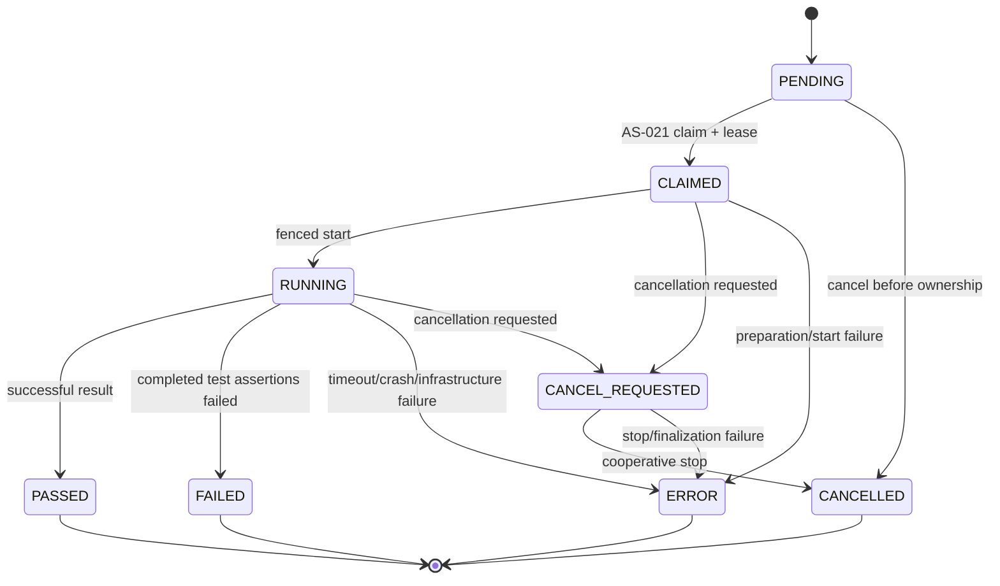
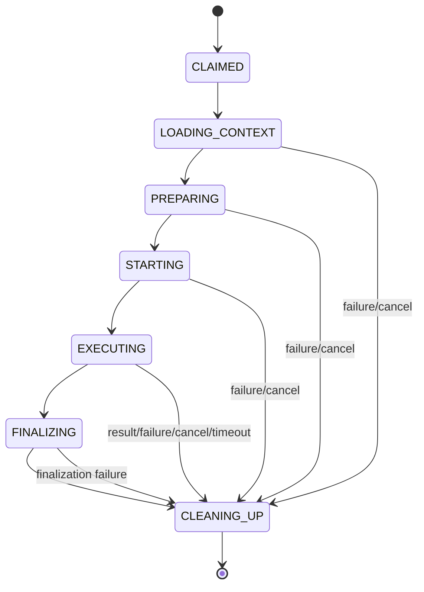
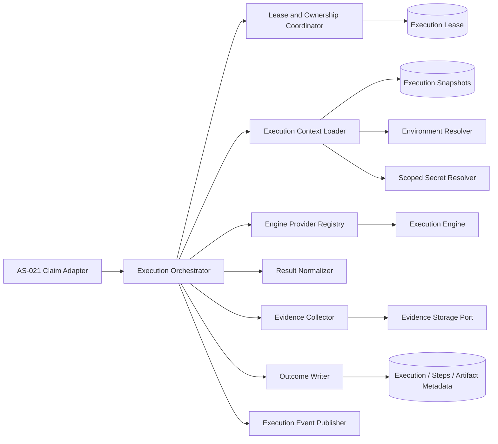
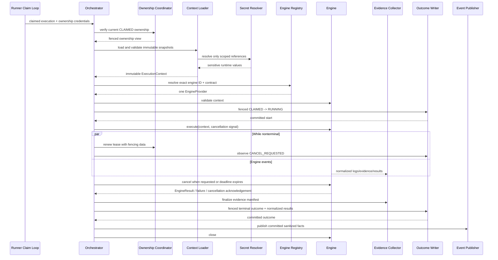

# AS-022: Runner Execution Orchestrator Software Requirements Specification

## 1. Executive Summary

**Status:** AS-022A architecture baseline; documentation only and pending review.

AS-022 begins execution after AS-021 has atomically selected compatible work, changed the
execution to `CLAIMED`, and created its renewable `execution_lease`. The runner-side orchestrator
loads an immutable execution context, resolves runtime-only inputs, selects an engine through a
provider-neutral contract, supervises execution, collects normalized results and evidence, and
persists one authoritative outcome.

The orchestration core depends on engine abstractions, not Playwright, Selenium, Karate, REST
Assured, or another provider. External work never runs inside the scheduling transaction or a
long-lived database transaction.

## 2. Background and Existing Boundary

AS-018 owns execution admission, immutable snapshots, lifecycle, cancellation intent, runtime
step/artifact concepts, and terminal outcomes. AS-019 owns the PostgreSQL queue, renewable lease,
claim token, generation, lease-local version, database-time expiry, heartbeat, and fencing.
AS-020 owns runner identity, lifecycle, health, capabilities, and maximum concurrency. AS-021
owns compatible selection and the atomic scheduling transaction.

AS-022 consumes, but does not replace, those decisions:

```text
AS-021 scheduling transaction commits
    -> execution is CLAIMED
    -> execution_lease identifies the runner and fencing generation
    -> AS-022 may prepare and execute the claimed work
```

The execution and its lease remain the authoritative business state and ownership records.
AS-022 adds no second queue, assignment, reservation, or ownership token.

## 3. Goals

AS-022 shall:

- execute a valid claimed execution under its current AS-019 lease;
- remain independent of any particular automation engine;
- construct one immutable `ExecutionContext` before engine invocation;
- preserve AS-018 admission snapshots without consulting mutable catalog state for execution
  meaning;
- resolve secrets only at runtime and keep resolved values out of durable snapshots, events,
  evidence metadata, errors, and ordinary logs;
- supervise startup, execution, timeout, cooperative cancellation, cleanup, and finalization;
- normalize engine results and evidence descriptions;
- make state changes through short, fenced, transactional persistence operations;
- produce exactly one durable terminal outcome for an owned execution; and
- define stable extension points for future engine providers and evidence storage adapters.

## 4. Non-Goals for AS-022A

AS-022A does not add or change:

- Java production or test code;
- database tables, columns, constraints, indexes, or Flyway migrations;
- REST routes, requests, responses, or controllers;
- engine implementations or plugin loading;
- secret-manager, source-workspace, event-bus, or artifact-store implementations; or
- retry, resume, distributed, parallel, or remote-cluster behavior.

## 5. Terminology and State Model

### 5.1 Authoritative execution lifecycle

AS-022 preserves the AS-018 persisted lifecycle:



`PASSED`, `FAILED`, `ERROR`, and `CANCELLED` are terminal. AS-022 does not persist new
`STARTING`, `COMPLETED`, `TIMED_OUT`, or generic `FAILED` aliases. In particular:

- successful completion maps to `PASSED`;
- completed automation with assertion/test failures maps to `FAILED`;
- startup failure, engine crash, timeout, infrastructure failure, or unexpected orchestration
  failure maps to `ERROR`; and
- acknowledged cooperative cancellation maps to `CANCELLED`.

### 5.2 Runner-local orchestration phases

Fine-grained phases are runner-local operational state, not a second business lifecycle:



These phases may be emitted as bounded, secret-safe telemetry. They are not restart checkpoints,
do not authorize work, and need not survive runner process loss in the first implementation.

## 6. Immutable Execution Context

The orchestrator shall build exactly one immutable `ExecutionContext` before selecting or
invoking an engine. Its collections and nested values shall be immutable or defensive deep
copies. It shall contain:

| Area | Required information |
|---|---|
| Identity | Execution ID, Project ID, request time, selection mode, and requester where needed for audit |
| Ownership | Runner key, claim token held only by the ownership component, lease generation, lease version, and lease expiry |
| Execution snapshot | Immutable request snapshot and ordered selected-test-case snapshots |
| Project | Project identity and only admitted non-secret execution metadata |
| Automation Suite | Immutable suite identity, engine ID, native suite/source reference, and admitted non-secret configuration |
| Environment | Immutable environment identity, type, base URL, admitted non-secret configuration, and secret-reference metadata |
| Variables | Deterministically merged execution variables with source/provenance and explicit precedence |
| Secrets | Resolved scoped secret values in a dedicated sensitive-value view, never folded back into snapshots or normal variable maps |
| Engine | Canonical engine identifier and contract version/capabilities selected for this invocation |
| Runner | Runner ID/key, implementation version, platform/runtime metadata, capabilities, and labels needed by execution |
| Controls | Overall deadline, cancellation signal, evidence policy, and bounded working-directory references |

The authoritative source for execution meaning is the admitted snapshot, not the current Project,
Environment, Automation Suite, or Automation Test Case records. Mutable records may be read only
for explicitly approved operational policy that cannot change the admitted test meaning.

Historical executions with absent, malformed, inconsistent, or unsupported required snapshots
fail closed before engine invocation. The orchestrator must not guess, repair, or silently replace
their meaning.

Variable precedence must be explicit and deterministic. The initial contract is:

```text
platform defaults
    < admitted environment variables
    < admitted suite variables
    < admitted execution-request variables
```

Later layers override earlier layers by exact key. Duplicate keys within one layer, invalid
names, unsupported types, or ambiguous interpolation are validation failures. Secret references
are resolved after non-secret merging and exposed separately; a secret value never becomes a
persisted execution variable.

## 7. Component Boundaries



Responsibilities are:

- **Execution Orchestrator:** orders the workflow, owns deadlines and cancellation supervision,
  and selects deterministic failure precedence. It contains no provider-specific behavior.
- **Lease and Ownership Coordinator:** validates runner key, claim token, generation, lease
  version, expiry, and execution status; renews ownership; fences all mutations; and prevents a
  stale runner from starting or finalizing.
- **Execution Context Loader:** reads immutable snapshots and ordered selections, validates their
  consistency, merges non-secret variables, and returns one immutable context.
- **Environment Resolver:** interprets only the admitted environment snapshot into normalized
  runtime configuration.
- **Scoped Secret Resolver:** resolves only references authorized for this execution and returns
  redaction-aware sensitive values with bounded lifetime.
- **Engine Provider Registry:** finds exactly one compatible provider by canonical engine ID and
  supported contract version. Missing, duplicate, or incompatible providers fail before start.
- **Execution Engine:** validates provider-specific configuration, starts and cancels native
  work, and emits normalized results/evidence. It does not access platform repositories.
- **Result Normalizer:** validates and converts engine output to platform result, step, duration,
  and error categories.
- **Evidence Collector:** accepts bounded evidence descriptors/streams and passes them to an
  evidence storage port. It does not decide the business outcome.
- **Outcome Writer:** performs fenced, idempotent, short transactions for start and terminal
  state persistence.
- **Execution Event Publisher:** publishes sanitized facts only after their associated state is
  durable. Delivery mechanism and durable outbox changes require a later decision.

## 8. Engine Contract

The runner shall depend on a provider-neutral contract conceptually equivalent to:

```text
EngineProvider
    descriptor() -> EngineDescriptor
    validate(ExecutionContext) -> ValidationResult
    create(ExecutionContext, EngineEventSink) -> EngineSession

EngineSession
    execute(CancellationSignal) -> EngineResult
    cancel(CancellationReason) -> CancellationAcknowledgement
    close()
```

The final Java shape is deferred to an implementation phase. The semantic contract requires:

- stable, case-sensitive engine ID and implementation version;
- supported orchestrator contract versions and declared capabilities;
- deterministic preflight validation;
- one session per execution;
- normalized result, log, step, attachment, screenshot, console, and metadata events;
- cooperative cancellation and idempotent cleanup;
- no direct database, lease, scheduling, authorization, arbitrary secret-store, or event-bus
  access; and
- no authority to assign the durable execution status.

Provider discovery must fail closed unless exactly one enabled provider matches the admitted
engine ID and a supported contract version. Provider order, classpath order, or friendly name
must never choose an engine. Playwright is one future provider, not an orchestration special case.

## 9. Orchestration Flow



Required ordering:

1. Receive a successful AS-021 claim only after its scheduling transaction commits.
2. Validate that the execution is `CLAIMED` and the lease fencing tuple still belongs to this
   runner.
3. Load and validate immutable execution, suite, environment, Project, and selection data.
4. Resolve non-secret environment configuration and deterministic variables.
5. Resolve only referenced, authorized secrets into memory.
6. Select exactly one provider by engine ID and contract compatibility.
7. Run provider preflight validation.
8. Atomically and conditionally persist `CLAIMED -> RUNNING` under the current lease.
9. Execute while renewing the lease, observing cancellation, enforcing the deadline, and
   collecting bounded normalized events.
10. Normalize the engine result and evidence manifest.
11. Atomically persist the terminal state and related normalized facts under the same fencing
    authority.
12. Publish sanitized post-commit events and perform idempotent cleanup.

If cancellation is already requested before engine start, engine invocation is skipped and the
orchestrator attempts fenced completion to `CANCELLED`. Cancellation that races with start must
be serialized by the authoritative lifecycle/version check; it must not be overwritten.

## 10. Transactions, Leasing, and Determinism

Scheduling, external preparation, engine execution, evidence transfer, and final persistence are
separate boundaries. No source checkout, network secret lookup, engine startup, engine execution,
artifact upload, or event publication may occur while holding AS-021 scheduling locks or a
database transaction open.

Start and completion are short transactions. Each mutation shall condition on:

```text
execution ID
+ expected execution status/version
+ runner key
+ claim token
+ lease generation
+ expected lease version where required
+ unexpired current ownership according to PostgreSQL time
```

A failed fence affects zero rows and stops persistence by that runner. Claim tokens are
credentials, not correlation IDs, and never enter logs, evidence, engine-visible metadata, or
events.

Before AS-022 implementation, the AS-019 heartbeat contract must be deliberately reconciled so
the current owner can renew while execution is `RUNNING` and, where cooperative shutdown is in
progress, `CANCEL_REQUESTED`. This must preserve generation/version fencing and database-time
expiry. AS-022 must not silently rely on the current `CLAIMED`-only renewal behavior.

Determinism requires:

- snapshots, not mutable catalog values, determine the run;
- exact engine selection by ID and contract version;
- documented variable precedence and stable selected-case order;
- one platform deadline from a monotonic elapsed-time source, with persisted timestamps from the
  approved server/database time authority;
- deterministic primary failure precedence;
- stable result normalization independent of event arrival timing; and
- one terminal write, safe against duplicate callbacks or completion attempts.

The initial failure precedence is:

```text
lost ownership
    > accepted cancellation
    > enforced timeout
    > engine/infrastructure/orchestration error
    > completed engine result
```

Lost ownership means the runner stops work and performs no further authoritative write. It does
not infer a terminal state because another owner or recovery policy may be authoritative.

## 11. Cancellation and Timeout

Cancellation is cooperative:

- the orchestrator observes durable `CANCEL_REQUESTED` or a local ownership-coordinator signal;
- it signals the engine session once, with idempotent repeats allowed;
- it allows a configured grace period;
- it escalates to provider isolation/process termination only where the provider contract and
  deployment model support it;
- it records `CANCELLED` only after work has stopped sufficiently to prevent further result
  production; and
- failure to stop safely records `ERROR`, if ownership remains valid.

Timeout uses the same cancellation path but retains `TIMEOUT` as a structured error category and
maps the durable execution status to `ERROR`. A timeout must not be reported as `FAILED`, because
it is not a completed assertion result. Timeout values come from admitted policy/context, use
bounded platform defaults, and cannot be extended by an engine.

## 12. Evidence Collection

The engine emits evidence through an orchestrator-owned sink. Evidence kinds initially include:

- structured and textual logs;
- screenshots;
- standard output and standard error;
- browser/device console output;
- attachments and native reports; and
- bounded metadata such as media type, logical name, size, checksum, timestamps, step/test
  association, and engine-specific type under a namespaced key.

Evidence bytes and artifact metadata are separate concerns. An evidence storage port owns byte
transfer and returns an opaque locator/checksum; platform persistence owns reviewed metadata and
execution association. Engines never write directly to platform storage or database tables.

Evidence processing must:

- stream or spool with per-item and per-execution limits instead of accumulating unbounded data;
- sanitize filenames and prevent path traversal;
- compute integrity metadata;
- redact known resolved secrets from textual channels on a best-effort defense-in-depth basis;
- never treat redaction as permission to emit secrets;
- preserve ordering metadata without requiring globally ordered concurrent streams;
- tolerate an individual optional evidence failure without changing a valid test result; and
- classify required evidence or evidence-infrastructure failure according to explicit policy.

Actual object/filesystem storage, retention, signed access, malware scanning, and upload protocol
are deferred.

## 13. Error Classification and Handling

| Failure | Durable outcome when ownership remains valid | Retry classification | Required handling |
|---|---|---|---|
| Invalid/missing immutable context | `ERROR` before engine start | Non-retryable | Fail closed; sanitized validation category |
| No/duplicate/incompatible engine provider | `ERROR` before engine start | Non-retryable until deployment changes | Identify engine ID, not configuration/secrets |
| Engine startup failure | `ERROR` | Policy-dependent | Close partial session; retain bounded diagnostics |
| Engine crash/protocol loss | `ERROR` | Policy-dependent | Stop input, collect available diagnostics, clean up |
| Test assertion failures | `FAILED` | Non-retryable by infrastructure policy | Persist normalized completed result |
| Timeout | `ERROR` with `TIMEOUT` category | Normally non-retryable | Signal cancellation, enforce grace period, clean up |
| Accepted cancellation | `CANCELLED` | Non-retryable | Stop work and acknowledge cancellation |
| Secret resolution/authorization failure | `ERROR` | Non-retryable unless transient backend outage | Never expose reference details or values |
| Evidence storage failure | Result or `ERROR` according to required-evidence policy | Policy-dependent | Preserve manifest failure without fabricating locator |
| Database/event infrastructure failure | No fabricated success; retry bounded finalization only while owned | Retryable operation, not execution | Keep engine from rerunning; fence every write |
| Unexpected exception | `ERROR` | Non-retryable by default | Catch at orchestrator boundary, sanitize, cleanup |
| Lost/expired/replaced lease | No write by stale runner | Not an execution retry | Stop work; fencing is authoritative |

Cleanup runs in a `finally`-equivalent boundary, is idempotent, has its own deadline, and cannot
replace a more important primary outcome. Cleanup failures are recorded as secondary diagnostics
unless they prove work could not be stopped safely.

## 14. Retry Philosophy

AS-022A defines classification only; it implements no execution retry.

Potentially retryable failures are transient conditions that occurred before externally
meaningful automation work, or idempotent infrastructure operations such as a bounded evidence
upload or fenced final-state write. Examples include temporary secret-store unavailability,
engine process launch resource exhaustion, or transient storage/database unavailability.

Non-retryable failures include invalid snapshots/configuration, unsupported engine/contract,
authorization denial, completed assertion failures, explicit cancellation, deterministic engine
validation failures, and timeouts unless a future approved policy says otherwise.

Retrying persistence or publication is not permission to invoke the engine again. Any future
execution retry requires an explicit attempt identity, policy, limits, idempotency semantics,
history, lease behavior, and user-visible outcome model. Those decisions are deferred.

## 15. Security and Isolation

- Resolved secrets exist only for the invocation scope, use redaction-aware wrappers, and are
  cleared/released where technically practical.
- Engines receive only secrets explicitly referenced and authorized for the execution.
- Claim tokens remain inside the ownership coordinator and are never passed to engines.
- Working paths are execution-scoped, canonicalized, bounded, and cleaned idempotently.
- Engine-controlled names and metadata are untrusted, bounded, normalized, and sanitized.
- Engine events cannot choose database identifiers, statuses, storage paths, or event topics.
- Provider integrity/signing, untrusted plugin sandboxing, and process/container isolation need
  later decisions; the first provider must still run behind the same contract.
- Logs, errors, events, and evidence metadata must not contain complete snapshots, environment
  values, credentials, tokens, private keys, or arbitrary runner host details.

## 16. Observability and Events

Operational signals may include execution ID, runner key where policy permits, engine ID,
contract/implementation version, orchestration phase, normalized failure category, elapsed
duration, evidence counts/bytes, cancellation source, and outcome.

Signals must exclude claim tokens, secret references/values, raw variables, full snapshots,
unbounded engine output, and high-cardinality native metadata. Correlation uses execution ID and
a future approved attempt/run identifier, never the claim token.

Lifecycle/result events describe committed facts. They are published after commit and consumers
must tolerate duplicates. A durable outbox and delivery guarantee are not introduced by AS-022A;
an implementation phase must either use an existing approved mechanism or bring a separate
decision to review before claiming reliable publication.

## 17. Acceptance Criteria

- [ ] Requirements, ADR-012, and the development log are complete and mutually consistent.
- [ ] The architecture is engine-neutral and contains no Playwright-specific orchestration path.
- [ ] Future providers are selected by stable engine ID and compatible contract, not discovery
  order.
- [ ] Component ownership and prohibited dependencies are explicit.
- [ ] One immutable `ExecutionContext` is built from admitted snapshots before invocation.
- [ ] Mutable catalog state cannot change the meaning of an admitted execution.
- [ ] Resolved secrets are runtime-only and excluded from persistence and ordinary telemetry.
- [ ] Persisted lifecycle terms remain compatible with AS-018.
- [ ] Runner-local phases do not create a second durable lifecycle.
- [ ] Claim, start, heartbeat, cancellation, completion, and lost-ownership behavior preserve
  AS-019/AS-021 fencing and transactional integrity.
- [ ] External work occurs outside scheduling and persistence transactions.
- [ ] Engine, orchestration, evidence, and infrastructure failures have deterministic mappings.
- [ ] Retryable and non-retryable classifications do not implement execution retry.
- [ ] Logs, screenshots, console output, attachments, and metadata have a provider-neutral
  evidence boundary.
- [ ] Sequence and lifecycle diagrams describe the complete flow.
- [ ] Deferred features and decisions remain explicitly out of scope.
- [ ] AS-022A changes documentation only.

## 18. Deferred Scope and Decisions

Explicitly deferred:

- distributed execution and remote execution clusters;
- parallel execution within one execution;
- execution retries, attempts, and retry policy implementation;
- execution resume and crash recovery after `RUNNING`;
- artifact/evidence storage implementation and retention;
- execution video recording and live streaming;
- engine plugin marketplace, dynamic installation, trust, and signing;
- execution history UI;
- process/container isolation for untrusted engines;
- source checkout and workspace implementation;
- concrete secret-provider integration;
- durable event outbox/delivery implementation;
- engine contract wire/Java shape and version-negotiation details;
- result schema and engine-specific configuration schemas;
- orphaned `RUNNING` ownership recovery policy; and
- authentication and authorization enforcement for runner and secret access.

## 19. Proposed Delivery Phases

Every phase requires review before the next begins.

### AS-022A - Requirements, Architecture, and ADR

Documentation only. Define lifecycle, context, boundaries, engine contract, flow, evidence,
failures, retry philosophy, security, and deferred decisions.

### AS-022B - Orchestration Domain and Engine Contract

Define immutable context/result/error models, provider-neutral interfaces, engine registry
semantics, and contract tests. No concrete engine or external resource implementation.

### AS-022C - Fenced Lifecycle and Ownership Coordination

Implement conditional start/completion operations and reconcile renewable ownership across
`RUNNING` and `CANCEL_REQUESTED`, preserving database time, lease generation/version fencing,
lock order, rollback, and cancellation races.

### AS-022D - Context Loading and Runtime Resolution

Implement immutable snapshot loading, deterministic variables, environment normalization, scoped
secret-resolution port, fail-closed validation, and secret-safety tests.

### AS-022E - Orchestration Core

Compose preflight, deadlines, cancellation, engine invocation, normalization, cleanup, and
fenced finalization without a concrete provider.

### AS-022F - Evidence and Event Ports

Implement bounded evidence intake, metadata normalization, storage/publisher ports, sanitization,
and failure policies without selecting a durable storage or delivery technology.

### AS-022G - Initial Engine Adapter and Integration

Add the separately approved first engine provider behind the common contract and prove that the
orchestrator contains no provider-specific branching.

### AS-022H - Operational Hardening and Reconciliation

Prove races, timeouts, cancellation, lost ownership, duplicate callbacks, cleanup, secret
exclusion, full regression, and final documentation consistency.

