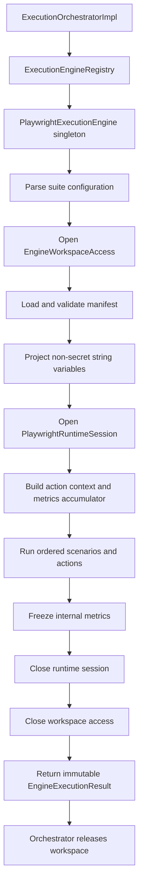

# AS-024F - Playwright ExecutionEngine Integration

## Status

AS-024F — IMPLEMENTATION AND TESTS COMPLETE, PENDING FINAL REVIEW

The full focused lifecycle matrix is implemented in `PlaywrightExecutionEngineTest`: validation,
ordered success and assertion mapping, stage isolation, cleanup precedence, deterministic timing
and trusted identity, metrics/action-context composition, concurrency isolation, and lifecycle
sanitization regression. Focused AS-024F verification is 28 total and 28 passed. Manifest-loader
verification is 53 total, 52 passed, and 1 skipped. Pre-lifecycle full-suite evidence is 1002 total,
994 passed, 8 skipped, 0 failures, and 0 errors; the updated full suite is 1015 total, 1007 passed,
8 skipped, 0 failures, and 0 errors. Tests use mocks only; no browser was launched.
AS-024F is not approved, AS-024G remains blocked, and no commit or push occurred.

Lifecycle tests: 13 passed
Sanitization tests: 14 passed
Registration tests: 1 passed
Focused AS-024F total: 28 passed

Final-review test remediation covers runner failure combined with workspace cleanup failure,
asserts ordinary runner-failure reverse cleanup, and validates concurrent calls as complete
request-consistent scenario/context/metrics tuples. Both results retain execution, workspace, and
revision identity; manifests, variables, sessions, startup metrics, accumulators, and resource
closures remain isolated. No production code changed.

Production integration, Spring registration verification, exception sanitization/classification,
startup-invariant handling, and the full focused lifecycle suite are complete locally. AS-024F is
not approved, and this status does not authorize AS-024G work, a commit, or a push.

The full engine-test implementation was paused after production review found that typed lower-level
exceptions could leave the engine with raw messages. The integration boundary now maps
configuration, workspace, manifest, runtime, action, metrics/timing, cleanup, and unexpected
failures to stable engine codes and fixed public messages. Original failures remain causes only.
This paragraph records the historical production-review pause; that gate was later cleared.
Runtime and workspace cleanup failures use separate sanitized engine exceptions; when failures are
combined, only sanitized engine exceptions participate in the public suppression chain.

The sanitization re-review returned `CHANGES REQUIRED`: workspace-access usage during manifest
resolution was misclassified as manifest failure and discarded the original workspace cause, while
post-start runtime failures used the startup classification. Catch ordering now propagates only the
typed workspace-access failure to the engine boundary, and runtime startup and post-start execution
use distinct fixed classifications. At that historical gate thirteen focused sanitization
scenarios passed and lifecycle implementation was temporarily paused. That gate was later cleared,
and the lifecycle matrix was implemented. AS-024G remains blocked and no commit or push occurred.

The latest focused re-review returned `CHANGES REQUIRED` because a null session returned from the
runtime-opening boundary was misclassified as a metrics failure. The boundary now validates the
session immediately and maps null to the fixed runtime-start failure with a fixed internal cause.
Runner non-interaction assertions were strengthened for workspace-usage and post-start runtime
failures. Current evidence is 14 sanitization tests passed; manifest loader 53 total, 52 passed and
1 skipped because Windows/platform link creation is unavailable; registration 1 passed. This was
the final historical lifecycle pause; the gate was later cleared and the lifecycle suite was
implemented. AS-024G remains blocked and no commit or push occurred.

## Purpose

AS-024F composes the approved AS-023 workspace boundary and AS-024B through AS-024E Playwright
components into one provider-neutral `ExecutionEngine`. It adds no browser operation, manifest
action, provider-neutral result field, persistence model, API, or workspace-lifecycle authority.

## Repository Baseline

The plan is based on the contracts currently present at `4c92ae0`:

- `EngineExecutionRequest` supplies the immutable `ExecutionContext` and prepared AS-023 source;
- `EngineExecutionResult` permits only identity, source evidence, state, timestamps, and duration;
- `EngineExecutionState` contains `SUCCEEDED`, `FAILED`, and `CANCELLED`;
- `EngineWorkspaceAccessResolver` is the only approved physical-workspace entry point;
- `PlaywrightConfigurationParser`, `PlaywrightScenarioManifestLoader`, `PlaywrightRuntime`, and
  `PlaywrightOrderedScenarioRunner` already own their respective validation and execution rules;
- `PlaywrightRuntimeMetrics` remains internal transient telemetry; and
- `ExecutionOrchestratorImpl` remains responsible for releasing the workspace.

No ADR amendment is required. This composition follows ADR-014 without introducing a new
architectural decision.

## Integration Contract

`PlaywrightExecutionEngine` must:

1. implement `ExecutionEngine` and return `PlaywrightEngineDescriptor.descriptor()`;
2. remain a stateless Spring singleton and perform no browser or workspace work at bean creation;
3. have `validate(ExecutionContext)` delegate to `PlaywrightConfigurationParser.parse` without
   opening workspace access or a runtime;
4. override `execute(EngineExecutionRequest)` directly rather than relying on the legacy
   `execute(ExecutionContext)` adapter;
5. reject a null or inconsistent request before acquiring resources: suite engine ID must equal
   `playwright-java` exactly, suite engine version must equal `1.61.0` exactly, context and
   preparation execution IDs must match, and context and prepared workspace IDs must match;
6. open physical paths only with
   `EngineWorkspaceAccessResolver.open(EngineWorkspaceAccessRequest.from(preparation))`;
7. load exactly the suite-referenced manifest through `PlaywrightScenarioManifestLoader`;
8. project only string-valued non-secret interpolation values from the immutable
   `ExecutionContext.variables()` snapshot;
9. ignore unrelated secret references, never substitute secret values, and allow unresolved
   manifest variables to fail only through `NonSecretVariableInterpolator`;
10. open one execution-scoped `PlaywrightRuntimeSession` with the parsed suite configuration;
11. execute manifest scenarios in their existing order through `PlaywrightOrderedScenarioRunner`;
12. freeze internal runtime metrics without adding them to `EngineExecutionResult`;
13. map a successful scenario outcome to `SUCCEEDED` and an assertion mismatch to `FAILED`;
14. throw a sanitized exception for access, configuration, manifest, runtime, action, or internal
    infrastructure failure; and
15. close the runtime session and workspace access in reverse acquisition order on every path.

`validate(ExecutionContext)` validates the exact descriptor identity and delegates configuration
validation to `PlaywrightConfigurationParser`; it performs no workspace, manifest, or runtime
work. `execute(EngineExecutionRequest)` repeats identity and configuration validation defensively,
then validates execution/workspace consistency against the prepared source before acquisition.
Engine identity comparisons are case-sensitive, untrimmed exact string comparisons. Preparation
contracts retain ownership of source/workspace invariants, and suite-reference/path validation
remains delegated to `PlaywrightScenarioManifestLoader`.

The current request/context contracts expose no cancellation token or deadline. AS-024F must not
fabricate cancellation. `CANCELLED` remains a valid provider-neutral state reserved for a future
approved cancellation boundary.

## Composition and Lifecycle

Acquisition order is workspace access, then runtime session. Cleanup order is runtime session,
then workspace access. The engine closes the access handle but never creates, deletes, or releases
the workspace and does not request the artifacts directory because publication is deferred.
Browser startup must occur only after configuration, workspace access, manifest, and interpolation
inputs have passed validation.

Cleanup follows ADR-014: a cleanup failure takes precedence over success or an earlier execution
failure, while the earlier failure is attached as suppressed diagnostic context. If both cleanup
operations fail, the later reverse-order cleanup failure is primary and retains the preceding
cleanup/execution chain as suppressed context. External messages remain sanitized.

## Result Mapping

| Internal outcome | Provider-neutral result | Required behavior |
|---|---|---|
| All planned actions succeed | `SUCCEEDED` | Return exact request, descriptor, workspace, revision, and timing evidence. |
| Assertion mismatch | `FAILED` | Return a normal result; do not convert it to an infrastructure exception. |
| Approved cancellation signal | `CANCELLED` | Reserved; no current input can produce it. |
| Any infrastructure or invariant failure | No result | Throw a sanitized typed runtime exception for orchestration to classify. |

`startedAt` and `finishedAt` use an injected `Clock`; `duration` is exactly
`Duration.between(startedAt, finishedAt)`. Engine timing begins immediately before workspace access
and ends after runtime-session and access-handle cleanup, so it includes workspace resolution,
manifest loading, browser startup, action execution, and normal close time. The result must copy
the execution ID, workspace ID, and resolved revision from the validated request and the engine
name/version from the descriptor.
Selectors, URLs, values, paths, page content, exception text, and Playwright types must never enter
the provider-neutral result.

The current result has no failure category, failure code, message, startup/action metrics,
artifacts, or metadata fields. AS-024F therefore maps none of those values and does not extend the
contract. The platform also has no retriable-failure distinction. Action and navigation timeout
failures remain sanitized infrastructure exceptions; there is no `TIMED_OUT` engine state.

## Failure Classification

| Failure source | Engine behavior | Cleanup required | External safety |
|---|---|---|---|
| Invalid request/identity invariant | Sanitized integration exception | Any acquired resource | No request object dump. |
| Invalid suite configuration | Preserve or wrap stable configuration classification | None | No configuration values. |
| Workspace access denial/layout/escape | Preserve sanitized workspace classification | Access if returned | No physical path. |
| Missing, unsafe, malformed, or unsupported manifest | Preserve sanitized manifest classification | Access | No path or manifest content. |
| Secret reference or invalid interpolation input | Sanitized integration/action classification | Access | No name/value/reference detail. |
| Browser provisioning/startup/runtime operation | Preserve sanitized runtime classification | Partial runtime, then access | No SDK/process output. |
| Unsupported action or action infrastructure failure | Preserve sanitized action classification | Runtime, then access | No selector, URL, or entered value. |
| Assertion mismatch | Normal `FAILED` result | Runtime, then access | No assertion payload in result. |
| Runtime or access close failure | Cleanup failure is primary | Continue remaining cleanup | Earlier failure suppressed internally. |
| Result/metric/timing invariant violation | Sanitized integration exception | Runtime, then access | No internal object dump. |

Logging is limited to stable codes and safe execution identifiers already approved by platform
conventions. Causes may be retained internally, but exception messages and logs must not include
repository URLs, filesystem paths, manifest content, selectors, entered or expected values,
environment values, secret references, browser output, or page content.

## Configuration and Variable Ownership

Suite-owned browser behavior continues to come only from `ExecutionContext.suite().configuration()`
through `PlaywrightConfigurationParser`. Operator-owned executable path, provisioning policy, and
runtime startup constraints remain in `PlaywrightRuntimeProperties` and the runtime adapter.
Manifest data cannot override operator-owned configuration.

The engine must build one immutable `Map<String, String>` from string-valued entries in
`ExecutionContext.variables()`. Each map key must agree with its `ExecutionVariable.name()`, and
each projected value must be accepted by `NonSecretVariableInterpolator`. Environment variables
are not read a second time because the execution snapshot is the integration boundary. Unrelated
entries in `ExecutionContext.secretReferences()` are ignored: AS-024F neither resolves them nor
places secret values in the interpolation map. A manifest variable absent from the projected
non-secret map fails only through `NonSecretVariableInterpolator`.

After the runtime session opens, the engine constructs `PlaywrightActionExecutionContext` from the
injected `SelectorResolver`, a `NonSecretVariableInterpolator` over the projected immutable map, a
`SameOriginNavigationPolicy` created from `ExecutionContext.environment().baseUrl()`, the parsed
`PlaywrightExecutionConfiguration`, the execution-local `PlaywrightRuntimeSession`, and a nonblank
scenario ID from the first validated manifest scenario. The ordered runner replaces that initial
ID for each scenario through its existing `forScenario` behavior. The engine also creates one
execution-local `PlaywrightActionMetricsAccumulator` using the exact total manifest-step count and
the `browserStartupDuration` supplied by `PlaywrightRuntimeSession.result().metrics()`.

## Metrics

| Metric invariant | AS-024F responsibility |
|---|---|
| `totalActions` | Count all manifest steps exactly once before execution. |
| `successfulActions` | Supplied by the ordered runner; never exceeds total. |
| `failedActions` | Supplied by the ordered runner; assertion/infrastructure terminal action counts once. |
| `totalExecutionDuration` | Monotonic action-runner measurement, non-negative. |
| `browserStartupDuration` | Copied from the opened runtime session result. |
| Immutability | Freeze one `PlaywrightRuntimeMetrics` value per execution. |
| Publication | Internal only; no provider-neutral result, persistence, REST, or logging change. |

The engine must validate that the runtime session and action outcome expose consistent immutable
metrics. A telemetry publication sink is not part of the current repository and must not be
invented in AS-024F.

Workspace resolution, manifest loading, and runtime closing are excluded from the lower-level
action duration. Browser startup duration retains the exact AS-024D boundary: SDK creation,
default-browser availability validation, and browser launch. It excludes browser-context creation
and page creation. Failures before action execution have no action outcome; runtime-startup or
manifest failures return no partial metrics because infrastructure failures return no
`EngineExecutionResult`. Negative or inconsistent timing fails closed through the existing metric
contracts.

## Spring Registration and Concurrency

The engine is a normal Spring component discovered by the existing `List<ExecutionEngine>`
registry injection. Its exact descriptor causes deterministic registry registration; duplicate
name/version registration remains rejected by `ExecutionEngineRegistryImpl`. No registry switch,
manual lookup table, or conditional browser startup is added.

Registration uses the same workspace-enablement condition as `LocalWorkspaceConfiguration`:
`@ConditionalOnProperty(name = "automation.runner.workspace.root")`. Workspace-disabled contexts
do not advertise the engine. Workspace-enabled contexts retain mandatory constructor injection of
`EngineWorkspaceAccessResolver` and register exactly one engine without opening workspace access,
loading a manifest, opening a runtime, or launching a browser.

All mutable state is execution-scoped in local variables, the runtime session, and the metrics
accumulator. Singleton collaborators must be immutable or thread-safe. Concurrent executions must
not share runtime sessions, access handles, variables, metrics, pages, contexts, or browser state.

## Acceptance Criteria

- The exact `playwright-java`/`1.61.0` engine is registered through the existing registry.
- Validation has no workspace, browser, process, or filesystem side effect.
- Execution uses only the prepared source and secure workspace-access boundary.
- Configuration and manifest validation finish before browser startup.
- All manifest steps run through the existing ordered runner and pluggable executor registry.
- Assertion mismatch returns `FAILED`; infrastructure failure throws a sanitized exception.
- Result identity, source evidence, state, timestamps, and exact duration satisfy all existing
  `EngineExecutionResult` and orchestration invariants.
- Internal metrics satisfy all existing counter and duration invariants and remain internal.
- Runtime and access cleanup occurs on success, assertion failure, startup failure, action failure,
  timing failure, result construction failure, and cleanup failure.
- Parallel unit tests demonstrate execution isolation and singleton safety.
- No Playwright SDK type leaks beyond the existing runtime adapter boundary.
- No manifest action bypasses the ordered runner or approved executor registry.
- Manifest path and content rules remain owned by the existing loader: relative containment,
  link/traversal/absolute-path rejection, regular-file checks, size/depth bounds, and schema
  validation are not duplicated in the engine. File extension is not a separate trust boundary;
  the loader validates bounded JSON content regardless of suffix.
- No process execution, browser installation, source compilation, persistence, REST, or artifact
  publication is introduced.

## Deferred Scope

Real-browser integration and hostile-environment verification remain AS-024G. Production
provisioning guidance and final documentation remain AS-024H. Cancellation inputs, durable
metrics, artifacts, secrets, retries, parallel scenarios, multiple pages/contexts, additional
browsers, and additional actions require later approved work.
